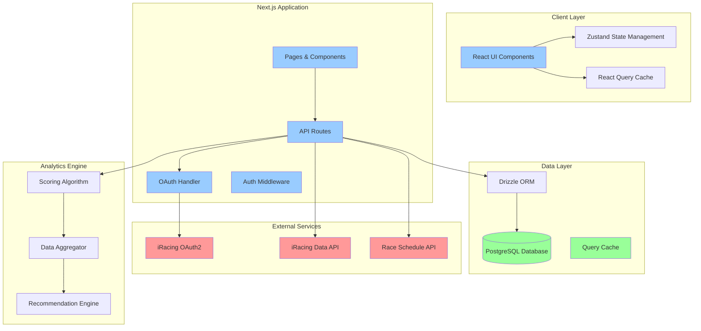
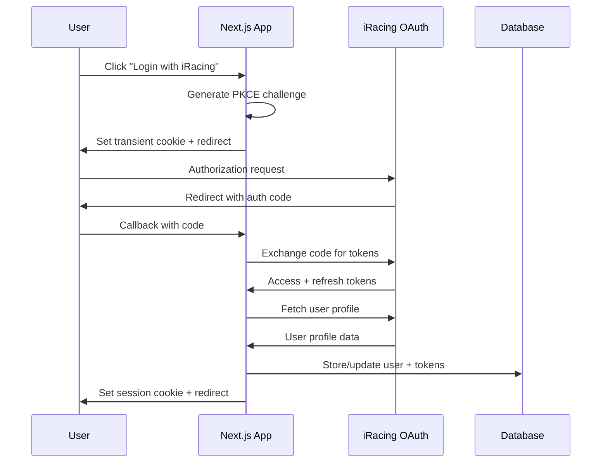

# Design Document: Racing Analytics Dashboard

## Overview

The Racing Analytics Dashboard is a sophisticated web application that integrates with iRacing's OAuth2 and Data API systems to provide data-driven racing recommendations. The application analyzes historical race performance across multiple dimensions and uses a multi-factor scoring algorithm to help users optimize their iRating, Safety Rating, or maintain a balanced approach to competitive racing.

The system architecture emphasizes real-time data processing, secure authentication, and responsive user experience while handling complex analytics computations and large datasets from the iRacing ecosystem.

## Technology Stack

### Frontend Framework
**Next.js 15 with React 19** - Full-stack React framework providing:
- Server-side rendering for optimal performance and SEO
- Built-in API routes for backend functionality
- Excellent TypeScript support
- Automatic code splitting and optimization
- Edge runtime capabilities for global performance

### Language & Type Safety
**TypeScript 5.9** - Provides:
- Static type checking for reduced runtime errors
- Enhanced developer experience with intelligent code completion
- Better maintainability for complex data structures
- Excellent integration with React and Next.js

### Styling & UI Components
**Tailwind CSS + Headless UI** - Modern utility-first approach:
- Rapid development with utility classes
- Consistent design system
- Racing-themed custom color palette
- Responsive design out of the box
- Headless UI for accessible, unstyled components

### Database & ORM
**Neon PostgreSQL + Drizzle ORM** - High-performance serverless data management:
- Neon's serverless PostgreSQL with automatic scaling and branching
- Built-in connection pooling optimized for serverless environments
- ACID compliance for financial and performance data integrity
- Excellent JSON support for flexible race result storage
- Drizzle provides type-safe database access with superior performance
- 10x smaller runtime bundle (~12KB vs ~120KB)
- Optimized SQL generation for complex analytics queries
- Better performance for read-heavy analytics workloads

### Authentication & Security
**Custom OAuth2 PKCE Implementation** - Secure iRacing integration:
- PKCE flow for enhanced security
- Secure token storage with encryption
- Session management with signed HTTP-only cookies
- Automatic token refresh handling

### Data Visualization
**Recharts + React Table** - Interactive analytics:
- Recharts for performance charts and trend visualization
- React Table for sortable, filterable data tables
- Custom racing-themed chart components
- Responsive design for mobile and desktop

### State Management
**Zustand + React Query (TanStack Query)** - Efficient data flow:
- Zustand for client-side state management
- React Query for server state, caching, and synchronization
- Optimistic updates for better user experience
- Background data refetching

### Development & Testing
**Jest + React Testing Library + Playwright + ESLint + Prettier** - Quality assurance:
- Jest for unit and integration testing with excellent React support
- React Testing Library for component testing
- Playwright for end-to-end testing
- ESLint with TypeScript rules
- Prettier for consistent code formatting

### Deployment & Infrastructure
**Vercel + Neon PostgreSQL** - Seamless serverless hosting:
- Vercel for Next.js deployment with edge functions and automatic scaling
- Neon PostgreSQL for serverless database with autoscaling and branching
- Environment-based configuration management
- Automatic HTTPS and global CDN distribution
- Built-in preview deployments for testing
- Database branching for safe schema migrations

## Architecture

### System Architecture Diagram



### Authentication Flow



## Components and Interfaces

### Core Components

#### 1. Authentication System
```typescript
interface AuthProvider {
  login(): Promise<void>
  logout(): Promise<void>
  refreshToken(): Promise<string>
  getCurrentUser(): Promise<User | null>
}

interface User {
  id: string
  iracingCustomerId: number
  displayName: string
  licenseClasses: LicenseClass[]
  createdAt: Date
  lastSyncAt: Date
}

interface LicenseClass {
  category: 'oval' | 'road' | 'dirt_oval' | 'dirt_road'
  level: 'rookie' | 'D' | 'C' | 'B' | 'A' | 'pro'
  safetyRating: number
  iRating: number
}
```

#### 2. Data Ingestion Service
```typescript
interface DataIngestionService {
  syncUserData(userId: string): Promise<SyncResult>
  fetchRaceResults(userId: string, dateRange: DateRange): Promise<RaceResult[]>
  fetchCurrentSchedule(): Promise<ScheduleEntry[]>
  normalizeSessionType(eventType: number, sessionName: string): SessionType
}

interface RaceResult {
  id: string
  subsessionId: number
  userId: string
  seriesId: number
  seriesName: string
  trackId: number
  trackName: string
  sessionType: SessionType
  startingPosition: number
  finishingPosition: number
  incidents: number
  strengthOfField: number
  raceDate: Date
  seasonYear: number // iRacing season year (e.g., 2024)
  seasonQuarter: number // iRacing season quarter (1, 2, 3, 4)
  raceWeekNum?: number // iRacing race week number (0-based)
  raceLength: number
}

type SessionType = 'practice' | 'qualifying' | 'time_trial' | 'race'

interface SeasonIdentifier {
  year: number
  quarter: number
}
```

#### 3. Analytics Engine
```typescript
interface AnalyticsEngine {
  calculatePerformanceMetrics(results: RaceResult[], groupBy: GroupingType): PerformanceMetric[]
  generateRecommendations(userId: string, mode: RecommendationMode): Promise<Recommendation[]>
  calculateScores(userId: string, opportunities: RacingOpportunity[]): ScoredOpportunity[]
}

interface PerformanceMetric {
  seriesId?: number
  seriesName?: string
  trackId?: number
  trackName?: string
  avgStartingPosition: number
  avgFinishingPosition: number
  positionDelta: number
  avgIncidents: number
  raceCount: number
  consistency: number
}

type GroupingType = 'series' | 'track' | 'series_track'
type RecommendationMode = 'balanced' | 'irating_push' | 'safety_recovery'
```

#### 4. Scoring Algorithm
```typescript
interface ScoringAlgorithm {
  calculateScore(opportunity: RacingOpportunity, userHistory: UserHistory, mode: RecommendationMode): Score
}

interface Score {
  overall: number // 0-100
  factors: {
    performance: number
    safety: number
    consistency: number
    predictability: number
    familiarity: number
    fatigueRisk: number
    attritionRisk: number
    timeVolatility: number
  }
  iRatingRisk: 'low' | 'medium' | 'high'
  safetyRatingRisk: 'low' | 'medium' | 'high'
  reasoning: string[]
}

interface RacingOpportunity {
  seriesId: number
  seriesName: string
  trackId: number
  trackName: string
  licenseRequired: LicenseLevel
  seasonYear: number // iRacing season year
  seasonQuarter: number // iRacing season quarter
  raceWeekNum: number // iRacing race week number (0-based)
  raceLength: number
  hasOpenSetup: boolean
  timeSlots: TimeSlot[]
  globalStats: GlobalStats
}
```

### API Endpoints

#### Authentication Endpoints
- `GET /api/auth/login` - Initiate OAuth flow
- `POST /api/auth/callback` - Handle OAuth callback
- `POST /api/auth/logout` - Logout and revoke tokens
- `GET /api/auth/me` - Get current user

#### Data Endpoints
- `GET /api/data/sync` - Trigger data synchronization
- `GET /api/data/results` - Get user race results with filtering (supports season_year, season_quarter params)
- `GET /api/data/schedule` - Get current race schedule for active season
- `GET /api/data/analytics` - Get performance analytics (supports season filtering)
- `GET /api/data/seasons` - Get available seasons for the user

#### Recommendation Endpoints
- `GET /api/recommendations` - Get personalized recommendations
- `POST /api/recommendations/score` - Calculate scores for specific opportunities

## Data Models

### Database Schema

```sql
-- Users table
CREATE TABLE users (
  id UUID PRIMARY KEY DEFAULT gen_random_uuid(),
  iracing_customer_id INTEGER UNIQUE NOT NULL,
  display_name VARCHAR(255) NOT NULL,
  created_at TIMESTAMP DEFAULT NOW(),
  updated_at TIMESTAMP DEFAULT NOW(),
  last_sync_at TIMESTAMP
);

-- iRacing account tokens
CREATE TABLE iracing_accounts (
  id UUID PRIMARY KEY DEFAULT gen_random_uuid(),
  user_id UUID REFERENCES users(id) ON DELETE CASCADE,
  access_token TEXT NOT NULL,
  refresh_token TEXT NOT NULL,
  access_token_expires_at TIMESTAMP NOT NULL,
  created_at TIMESTAMP DEFAULT NOW(),
  updated_at TIMESTAMP DEFAULT NOW()
);

-- License information
CREATE TABLE license_classes (
  id UUID PRIMARY KEY DEFAULT gen_random_uuid(),
  user_id UUID REFERENCES users(id) ON DELETE CASCADE,
  category VARCHAR(20) NOT NULL, -- 'oval', 'road', 'dirt_oval', 'dirt_road'
  level VARCHAR(10) NOT NULL, -- 'rookie', 'D', 'C', 'B', 'A', 'pro'
  safety_rating DECIMAL(4,2) NOT NULL,
  irating INTEGER NOT NULL,
  updated_at TIMESTAMP DEFAULT NOW()
);

-- Race results
CREATE TABLE race_results (
  id UUID PRIMARY KEY DEFAULT gen_random_uuid(),
  user_id UUID REFERENCES users(id) ON DELETE CASCADE,
  subsession_id BIGINT NOT NULL,
  series_id INTEGER NOT NULL,
  series_name VARCHAR(255) NOT NULL,
  track_id INTEGER NOT NULL,
  track_name VARCHAR(255) NOT NULL,
  session_type VARCHAR(20) NOT NULL, -- 'practice', 'qualifying', 'time_trial', 'race'
  starting_position INTEGER,
  finishing_position INTEGER,
  incidents INTEGER NOT NULL DEFAULT 0,
  strength_of_field INTEGER,
  race_date TIMESTAMP NOT NULL,
  season_year INTEGER NOT NULL, -- iRacing season year (e.g., 2024)
  season_quarter INTEGER NOT NULL, -- iRacing season quarter (1, 2, 3, 4)
  race_week_num INTEGER, -- iRacing race week number (0-based)
  race_length INTEGER, -- in minutes
  raw_data JSONB, -- store full iRacing response
  created_at TIMESTAMP DEFAULT NOW()
);

-- Current schedule cache
CREATE TABLE schedule_entries (
  id UUID PRIMARY KEY DEFAULT gen_random_uuid(),
  series_id INTEGER NOT NULL,
  series_name VARCHAR(255) NOT NULL,
  track_id INTEGER NOT NULL,
  track_name VARCHAR(255) NOT NULL,
  license_required VARCHAR(10) NOT NULL,
  category VARCHAR(20) NOT NULL,
  race_length INTEGER,
  has_open_setup BOOLEAN DEFAULT FALSE,
  season_year INTEGER NOT NULL, -- iRacing season year
  season_quarter INTEGER NOT NULL, -- iRacing season quarter
  race_week_num INTEGER NOT NULL, -- iRacing race week number (0-based)
  week_start DATE NOT NULL, -- actual calendar start date
  week_end DATE NOT NULL, -- actual calendar end date
  created_at TIMESTAMP DEFAULT NOW()
);

-- Indexes for performance
CREATE INDEX idx_race_results_user_series ON race_results(user_id, series_id);
CREATE INDEX idx_race_results_user_track ON race_results(user_id, track_id);
CREATE INDEX idx_race_results_date ON race_results(race_date);
CREATE INDEX idx_race_results_season ON race_results(season_year, season_quarter);
CREATE INDEX idx_race_results_user_season ON race_results(user_id, season_year, season_quarter);
CREATE INDEX idx_schedule_entries_season ON schedule_entries(season_year, season_quarter, race_week_num);
CREATE INDEX idx_schedule_entries_week ON schedule_entries(week_start, week_end);
```

### Drizzle Schema Definition

```typescript
import { pgTable, uuid, integer, varchar, timestamp, decimal, bigint, boolean, date, jsonb, index } from 'drizzle-orm/pg-core';
import { sql, eq, avg, count } from 'drizzle-orm';

// Users table
export const users = pgTable('users', {
  id: uuid('id').defaultRandom().primaryKey(),
  iracingCustomerId: integer('iracing_customer_id').unique().notNull(),
  displayName: varchar('display_name', { length: 255 }).notNull(),
  createdAt: timestamp('created_at').defaultNow(),
  updatedAt: timestamp('updated_at').defaultNow(),
  lastSyncAt: timestamp('last_sync_at'),
});

// iRacing account tokens
export const iracingAccounts = pgTable('iracing_accounts', {
  id: uuid('id').defaultRandom().primaryKey(),
  userId: uuid('user_id').references(() => users.id, { onDelete: 'cascade' }),
  accessToken: varchar('access_token').notNull(),
  refreshToken: varchar('refresh_token').notNull(),
  accessTokenExpiresAt: timestamp('access_token_expires_at').notNull(),
  createdAt: timestamp('created_at').defaultNow(),
  updatedAt: timestamp('updated_at').defaultNow(),
});

// License information
export const licenseClasses = pgTable('license_classes', {
  id: uuid('id').defaultRandom().primaryKey(),
  userId: uuid('user_id').references(() => users.id, { onDelete: 'cascade' }),
  category: varchar('category', { length: 20 }).notNull(), // 'oval', 'road', 'dirt_oval', 'dirt_road'
  level: varchar('level', { length: 10 }).notNull(), // 'rookie', 'D', 'C', 'B', 'A', 'pro'
  safetyRating: decimal('safety_rating', { precision: 4, scale: 2 }).notNull(),
  irating: integer('irating').notNull(),
  updatedAt: timestamp('updated_at').defaultNow(),
});

// Race results with computed position delta
export const raceResults = pgTable('race_results', {
  id: uuid('id').defaultRandom().primaryKey(),
  userId: uuid('user_id').references(() => users.id, { onDelete: 'cascade' }),
  subsessionId: bigint('subsession_id', { mode: 'number' }).notNull(),
  seriesId: integer('series_id').notNull(),
  seriesName: varchar('series_name', { length: 255 }).notNull(),
  trackId: integer('track_id').notNull(),
  trackName: varchar('track_name', { length: 255 }).notNull(),
  sessionType: varchar('session_type', { length: 20 }).notNull(), // 'practice', 'qualifying', 'time_trial', 'race'
  startingPosition: integer('starting_position'),
  finishingPosition: integer('finishing_position'),
  // Computed column for position delta (starting - finishing)
  positionDelta: integer('position_delta').generatedAlwaysAs(
    sql`starting_position - finishing_position`
  ),
  incidents: integer('incidents').notNull().default(0),
  strengthOfField: integer('strength_of_field'),
  raceDate: timestamp('race_date').notNull(),
  seasonYear: integer('season_year').notNull(), // iRacing season year (e.g., 2024)
  seasonQuarter: integer('season_quarter').notNull(), // iRacing season quarter (1, 2, 3, 4)
  raceWeekNum: integer('race_week_num'), // iRacing race week number (0-based)
  raceLength: integer('race_length'), // in minutes
  rawData: jsonb('raw_data'), // store full iRacing response
  createdAt: timestamp('created_at').defaultNow(),
}, (table) => ({
  // Indexes for performance
  userSeriesIdx: index('idx_race_results_user_series').on(table.userId, table.seriesId),
  userTrackIdx: index('idx_race_results_user_track').on(table.userId, table.trackId),
  dateIdx: index('idx_race_results_date').on(table.raceDate),
  seasonIdx: index('idx_race_results_season').on(table.seasonYear, table.seasonQuarter),
  userSeasonIdx: index('idx_race_results_user_season').on(table.userId, table.seasonYear, table.seasonQuarter),
}));

// Current schedule cache
export const scheduleEntries = pgTable('schedule_entries', {
  id: uuid('id').defaultRandom().primaryKey(),
  seriesId: integer('series_id').notNull(),
  seriesName: varchar('series_name', { length: 255 }).notNull(),
  trackId: integer('track_id').notNull(),
  trackName: varchar('track_name', { length: 255 }).notNull(),
  licenseRequired: varchar('license_required', { length: 10 }).notNull(),
  category: varchar('category', { length: 20 }).notNull(),
  raceLength: integer('race_length'),
  hasOpenSetup: boolean('has_open_setup').default(false),
  seasonYear: integer('season_year').notNull(), // iRacing season year
  seasonQuarter: integer('season_quarter').notNull(), // iRacing season quarter
  raceWeekNum: integer('race_week_num').notNull(), // iRacing race week number (0-based)
  weekStart: date('week_start').notNull(), // actual calendar start date
  weekEnd: date('week_end').notNull(), // actual calendar end date
  createdAt: timestamp('created_at').defaultNow(),
}, (table) => ({
  // Indexes for performance
  seasonIdx: index('idx_schedule_entries_season').on(table.seasonYear, table.seasonQuarter, table.raceWeekNum),
  weekIdx: index('idx_schedule_entries_week').on(table.weekStart, table.weekEnd),
}));

// Example analytics query with Drizzle
export async function getPerformanceMetrics(db: DrizzleDB, userId: string, groupBy: 'series' | 'track' | 'series_track') {
  const baseQuery = db
    .select({
      seriesId: raceResults.seriesId,
      seriesName: raceResults.seriesName,
      trackId: raceResults.trackId,
      trackName: raceResults.trackName,
      avgStartingPosition: avg(raceResults.startingPosition),
      avgFinishingPosition: avg(raceResults.finishingPosition),
      avgPositionDelta: avg(raceResults.positionDelta),
      avgIncidents: avg(raceResults.incidents),
      raceCount: count(),
    })
    .from(raceResults)
    .where(eq(raceResults.userId, userId));

  switch (groupBy) {
    case 'series':
      return baseQuery.groupBy(raceResults.seriesId, raceResults.seriesName);
    case 'track':
      return baseQuery.groupBy(raceResults.trackId, raceResults.trackName);
    case 'series_track':
      return baseQuery.groupBy(
        raceResults.seriesId, 
        raceResults.seriesName, 
        raceResults.trackId, 
        raceResults.trackName
      );
  }
}
```

## Correctness Properties

*A property is a characteristic or behavior that should hold true across all valid executions of a system—essentially, a formal statement about what the system should do. Properties serve as the bridge between human-readable specifications and machine-verifiable correctness guarantees.*

### Property-Based Testing Properties

Based on the prework analysis, the following properties will be implemented as property-based tests to ensure system correctness:

#### Property 1: OAuth Flow Security
*For any* OAuth authentication attempt, the system should generate unique PKCE challenges, securely store tokens upon successful completion, and automatically refresh expired tokens without user intervention.
**Validates: Requirements 1.2, 1.3, 1.4**

#### Property 2: Session Type Normalization
*For any* race result from the iRacing API, the system should correctly normalize the session type using event type fields or session names into exactly one of: Practice, Qualifying, Time Trial, or Race.
**Validates: Requirements 3.3**

#### Property 3: Performance Delta Calculation
*For any* race result with valid starting and finishing positions, the system should calculate position delta as (starting position - finishing position), where positive values indicate improvement and negative values indicate decline.
**Validates: Requirements 3.5, 4.8**

#### Property 4: Analytics Aggregation Consistency
*For any* set of race results, aggregating by Series, Track, or Series+Track combinations should produce consistent average calculations for starting position, finishing position, position delta, and incidents across all grouping methods.
**Validates: Requirements 4.2, 4.3, 4.4, 4.5**

#### Property 5: Comprehensive Filtering
*For any* combination of search terms, series categories, session types, and date ranges, the filtering system should return only results that match all applied criteria and update results in real-time.
**Validates: Requirements 5.1, 5.2, 5.3, 5.4, 5.5**

#### Property 6: License-Based Access Control
*For any* user with specific license levels, the recommendation system should exclude all series that require higher license levels than the user possesses across all racing categories.
**Validates: Requirements 6.3**

#### Property 7: Multi-Factor Scoring Algorithm
*For any* racing opportunity and user history, the scoring algorithm should evaluate all eight factors (Performance, Safety, Consistency, Predictability, Familiarity, Fatigue Risk, Attrition Risk, Time Volatility) and produce a score between 0-100 with separate risk indicators.
**Validates: Requirements 7.1, 7.2, 7.3, 7.4, 7.5, 7.6, 7.7, 7.8, 7.10**

#### Property 8: Mode-Based Weighting
*For any* set of scoring factors, applying different recommendation modes (Balanced, iRating Push, Safety Rating Recovery) should produce different weighted scores that reflect the priorities of each mode.
**Validates: Requirements 7.9**

#### Property 9: Data Synchronization Integrity
*For any* user login or data sync operation, the system should check for new data, integrate it without duplicates, and refresh all dependent analytics and recommendations.
**Validates: Requirements 9.1, 9.2, 9.5**

#### Property 10: Responsive Performance
*For any* interactive operation, the system should respond within 200ms and handle large datasets efficiently through pagination and virtualization.
**Validates: Requirements 10.2, 10.4**

#### Property 11: Security Token Management
*For any* authentication token storage or API communication, the system should use encryption for storage and HTTPS for all network communications.
**Validates: Requirements 11.1, 11.4**

#### Property 12: Logout Security
*For any* user logout operation, the system should revoke all tokens and clear all sensitive data from both client and server storage.
**Validates: Requirements 11.3**

## Error Handling

### Authentication Errors
- **Token Expiration**: Automatic refresh with fallback to re-authentication
- **OAuth Failures**: Clear error messages with retry mechanisms
- **Network Issues**: Offline detection with queue-based retry logic

### Data Processing Errors
- **API Rate Limits**: Exponential backoff with respect for iRacing's rate limit headers
- **Malformed Data**: Graceful degradation with error logging
- **Sync Failures**: Partial sync recovery with user notification

### User Interface Errors
- **Loading States**: Skeleton screens and progress indicators
- **Empty States**: Helpful messaging with actionable next steps
- **Validation Errors**: Real-time feedback with clear correction guidance

### Performance Degradation
- **Large Datasets**: Progressive loading with virtualization
- **Slow Networks**: Optimistic updates with conflict resolution
- **Memory Constraints**: Efficient data structures with garbage collection optimization

## Testing Strategy

### Dual Testing Approach
The application will use both unit testing and property-based testing for comprehensive coverage:

**Unit Tests with Jest and React Testing Library**:
- Component rendering and user interactions
- API endpoint functionality and error handling
- Database operations and data transformations
- Authentication flow edge cases
- UI state management and form validation

**Property-Based Tests with Jest and fast-check**:
- Universal properties that hold across all inputs (minimum 100 iterations per test)
- Complex business logic validation (scoring algorithms, aggregations)
- Data integrity across different input combinations
- Security properties (token handling, encryption)
- Performance characteristics under various loads

**End-to-End Tests with Playwright**:
- Complete user workflows from login to recommendations
- Cross-browser compatibility testing
- Mobile responsiveness validation
- Integration with iRacing API endpoints

### Test Configuration
- **Property Tests**: Minimum 100 iterations per property test
- **Test Tags**: Each property test tagged with format: **Feature: racing-analytics-dashboard, Property {number}: {property_text}**
- **Coverage Target**: 90% code coverage for critical paths
- **Performance Tests**: Response time validation for all interactive features

### Testing Data Strategy
- **Mock iRacing API**: Comprehensive test data covering edge cases
- **Test Database**: Isolated test environment with realistic data volumes
- **User Scenarios**: Multiple user profiles with different license levels and race histories
- **Schedule Simulation**: Mock race schedules for different time periods and license requirements