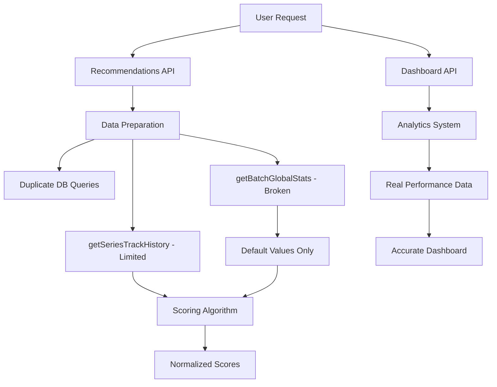
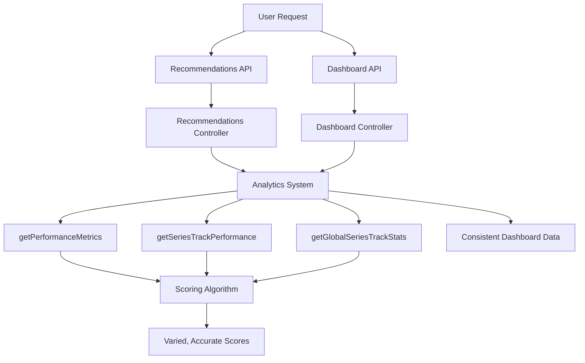

# Design Document: Recommendations-Analytics Integration

## Overview

This design refactors the recommendations system to eliminate code duplication and leverage the existing analytics infrastructure. The current recommendations system implements parallel data preparation logic that produces inaccurate scores due to fallback to default values. By integrating with the proven analytics system, recommendations will use real performance data and provide accurate, varied scoring that reflects user expertise.

**Important Design Considerations**:
- **Categories**: The system recognizes four racing categories: "road" (road racing), "oval" (oval racing), "dirt_road" (dirt road racing), and "dirt_oval" (dirt oval racing)
- **Race Sessions Only**: All recommendation calculations are based exclusively on actual race sessions (sessionType = 'race'), excluding practice, qualifying, and time trial sessions to ensure scoring reflects competitive performance

## Architecture

### Current Architecture Issues



### Target Architecture



## Components and Interfaces

### 1. Analytics System Integration Layer

**Purpose**: Adapter layer that maps analytics data to recommendation types.

```typescript
interface AnalyticsIntegration {
  getUserPerformanceData(userId: string): Promise<UserPerformanceData>;
  getGlobalStatistics(seriesId: number, trackId: number): Promise<GlobalStatistics>;
  getPrimaryCategory(userId: string): Promise<Category>;
  getConfidenceLevel(raceCount: number): ConfidenceLevel;
}

type ConfidenceLevel = 'high' | 'estimated' | 'no_data';

interface UserPerformanceData {
  seriesTrackHistory: SeriesTrackPerformance[];
  overallStats: OverallPerformance;
  primaryCategory: Category;
  licenseClasses: LicenseClass[];
}

interface SeriesTrackPerformance {
  seriesId: number;
  trackId: number;
  raceCount: number;
  avgPositionDelta: number;
  avgIncidents: number;
  consistency: number;
  confidenceLevel: ConfidenceLevel;
}

interface GlobalStatistics {
  avgIncidentsPerRace: number;
  avgFinishPositionStdDev: number;
  avgStrengthOfField: number;
  strengthOfFieldVariability: number;
  attritionRate: number;
  avgRaceLength: number;
  dataQuality: 'high' | 'moderate' | 'default';
}
```

### 2. Enhanced Scoring Algorithm

**Purpose**: Updated scoring that uses real analytics data and provides confidence indicators.

```typescript
interface EnhancedScore extends Score {
  dataConfidence: {
    performance: ConfidenceLevel;
    safety: ConfidenceLevel;
    consistency: ConfidenceLevel;
    familiarity: ConfidenceLevel;
    globalStats: 'high' | 'moderate' | 'default';
  };
  priorityScore: number; // Higher for familiar series/tracks
}

interface ScoredRecommendation extends RacingOpportunity {
  score: EnhancedScore;
  visualIndicators: VisualScoring;
}

interface VisualScoring {
  performance: ProgressBar;
  safety: ProgressBar;
  consistency: ProgressBar;
  predictability: ProgressBar;
  familiarity: ProgressBar;
  fatigueRisk: ProgressBar;
  attritionRisk: ProgressBar;
  timeVolatility: ProgressBar;
  overall: RacingBadge;
}

interface ProgressBar {
  value: number; // 0-100
  gradient: {
    startColor: string; // e.g., '#ff4444' (red)
    endColor: string;   // e.g., '#44ff44' (green)
    currentColor: string; // Calculated color at current value
  };
  icon: string; // Racing-themed icon
  tooltip: string;
}

interface RacingBadge {
  level: 'rookie' | 'contender' | 'champion' | 'legend';
  style: 'flag' | 'trophy' | 'helmet' | 'podium';
  colors: {
    primary: string;
    accent: string;
    text: string;
  };
  icon: string; // Racing-themed icon
  description: string;
  racingTheme: RacingBadgeTheme;
}

interface RacingBadgeTheme {
  // Flag-based themes (Racing-Authentic)
  checkeredFlag?: boolean;    // Excellent recommendation (90-100)
  greenFlag?: boolean;        // Good to go / recommended (75-89)
  yellowFlag?: boolean;       // Caution / moderate risk (50-74)
  blackFlag?: boolean;        // Disqualified / not recommended (0-49)
  
  // Trophy/Achievement themes  
  trophy?: 'gold' | 'silver' | 'bronze';
  podiumPosition?: 1 | 2 | 3;
  
  // Racing element themes
  helmet?: 'champion' | 'veteran' | 'rookie';
  raceNumber?: number;        // Like a race car number
  teamColors?: string[];      // Racing team color scheme
}
```

### 3. Primary Category Detection

**Purpose**: Automatically detect user's primary racing category for better defaults.

```typescript
interface CategoryAnalyzer {
  detectPrimaryCategory(userId: string): Promise<CategoryAnalysis>;
  getCategoryDistribution(userId: string): Promise<CategoryDistribution>;
}

interface CategoryAnalysis {
  primaryCategory: Category;
  confidence: number; // 0-1, based on percentage
  raceDistribution: CategoryDistribution;
}

interface CategoryDistribution {
  road: number;
  oval: number;
  dirt_road: number;
  dirt_oval: number;
  total: number;
}
```

### 4. Visual Scoring Renderer

**Purpose**: Convert numeric scores to racing-themed visual indicators.

```typescript
interface VisualScoringRenderer {
  renderProgressBar(score: number, factor: ScoringFactor): ProgressBar;
  calculateGradientColor(score: number): GradientColor;
  renderOverallBadge(score: number, confidence: ConfidenceLevel): RacingBadge;
  renderConfidenceBadge(level: ConfidenceLevel): ConfidenceBadge;
}

interface GradientColor {
  startColor: string; // Red at 0
  midColor: string;   // Yellow/Orange at 50  
  endColor: string;   // Green at 100
  currentColor: string; // Interpolated color at current score
  cssGradient: string; // CSS gradient string for styling
}

interface ConfidenceBadge {
  text: string; // "High Confidence", "Estimated", "No Personal Data"
  color: string;
  icon: string;
  description: string;
}

type ScoringFactor = 'performance' | 'safety' | 'consistency' | 'predictability' | 
                    'familiarity' | 'fatigueRisk' | 'attritionRisk' | 'timeVolatility';
```

## Data Models

### Enhanced Recommendation Response

```typescript
interface RecommendationResponse {
  recommendations: ScoredRecommendation[];
  userProfile: {
    primaryCategory: Category;
    licenseClasses: LicenseClass[];
    experienceSummary: ExperienceSummary;
  };
  metadata: {
    totalOpportunities: number;
    highConfidenceCount: number;
    estimatedCount: number;
    noDataCount: number;
    cacheStatus: 'hit' | 'miss';
  };
}

interface ExperienceSummary {
  totalRaces: number;
  seriesWithExperience: number;
  tracksWithExperience: number;
  mostRacedSeries: { seriesId: number; seriesName: string; raceCount: number }[];
  mostRacedTracks: { trackId: number; trackName: string; raceCount: number }[];
}
```

## Correctness Properties

*A property is a characteristic or behavior that should hold true across all valid executions of a system-essentially, a formal statement about what the system should do. Properties serve as the bridge between human-readable specifications and machine-verifiable correctness guarantees.*

### Property 1: Data Consistency Between Systems
*For any* user and any series-track combination, the performance data used in recommendations should be identical to the data displayed in the dashboard
**Validates: Requirements 1.2, 6.1**

### Property 2: Real-Time Data Synchronization  
*For any* user license or schedule update, both dashboard and recommendations should reflect the change within the same request cycle
**Validates: Requirements 1.3, 1.4**

### Property 3: Analytics Function Integration
*For any* recommendation calculation, the system should call the corresponding analytics function rather than implementing duplicate logic
**Validates: Requirements 2.1, 2.2, 2.3**

### Property 4: Familiarity Score Thresholds
*For any* user with 10+ races in a series, the familiarity score should be 80+ for that series; for 5+ races, the score should be 60+
**Validates: Requirements 3.2, 3.3**

### Property 5: Real Data Usage Over Defaults
*For any* series-track combination with historical data, the system should use actual statistics rather than default values
**Validates: Requirements 3.1, 4.2, 4.3, 5.1**

### Property 6: Confidence Level Accuracy
*For any* user with 3+ races in a series-track combination, the system should mark that data as "High Confidence" and use specific performance data
**Validates: Requirements 5.2**

### Property 7: Experience-Based Prioritization
*For any* recommendation list, series-track combinations where the user has 3+ races should be sorted higher than unfamiliar combinations
**Validates: Requirements 5.7**

### Property 8: Primary Category Detection
*For any* user with 70%+ races in one category, the system should identify that as their primary category and default to it
**Validates: Requirements 9.1, 9.2**

### Property 9: Score Variation Based on Experience
*For any* user with extensive experience in one series and no experience in another, the familiarity scores should be significantly different (>30 point difference)
**Validates: Requirements 12.1**

## Error Handling

### Data Availability Scenarios

1. **No Historical Data**: Use conservative defaults with clear "No Personal Data" indicators
2. **Insufficient Global Data**: Require minimum 10 races in 3 months for reliable statistics
3. **Analytics System Unavailable**: Graceful degradation to cached data or safe defaults
4. **Partial Data**: Use available data with appropriate confidence indicators

### Fallback Strategies

```typescript
interface DataFallbackStrategy {
  handleMissingPersonalData(seriesId: number, trackId: number): DefaultPerformanceData;
  handleInsufficientGlobalData(seriesId: number, trackId: number): ConservativeGlobalStats;
  handleAnalyticsFailure(): CachedRecommendations | ErrorResponse;
}
```

## Testing Strategy

### Unit Testing
- Test analytics integration functions with mock data
- Test confidence level calculations with various race counts
- Test primary category detection with different race distributions
- Test visual scoring renderer with edge case scores
- Test fallback strategies with missing data scenarios

### Property-Based Testing
Each correctness property will be implemented as a property-based test with minimum 100 iterations:

1. **Data Consistency Property**: Generate user data, verify dashboard and recommendations use identical performance metrics
2. **Familiarity Threshold Property**: Generate race counts, verify score thresholds are met
3. **Experience Prioritization Property**: Generate mixed experience data, verify sort order
4. **Primary Category Property**: Generate race distributions, verify category detection accuracy
5. **Real Data Usage Property**: Generate historical data, verify it's used instead of defaults

### Integration Testing
- Test complete recommendation flow with real analytics data
- Test visual rendering with various score combinations
- Test caching behavior with analytics system integration
- Test performance with large datasets

### Visual Testing
- Test progress bar colors and thresholds
- Test racing-themed styling consistency
- Test confidence badge rendering
- Test tooltip and expandable detail functionality

The testing strategy ensures both functional correctness and user experience quality while maintaining the racing aesthetic throughout the interface.