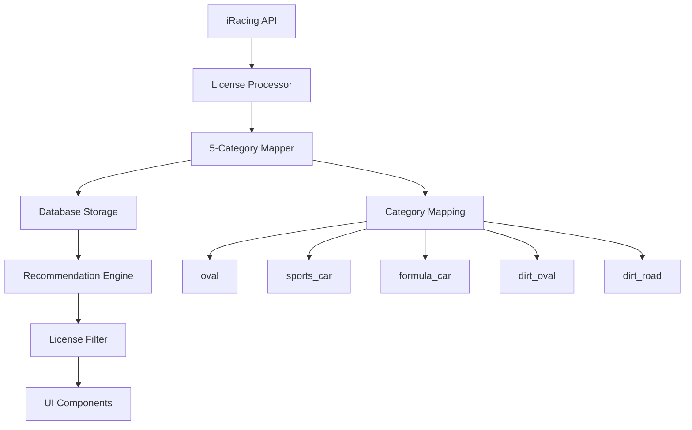
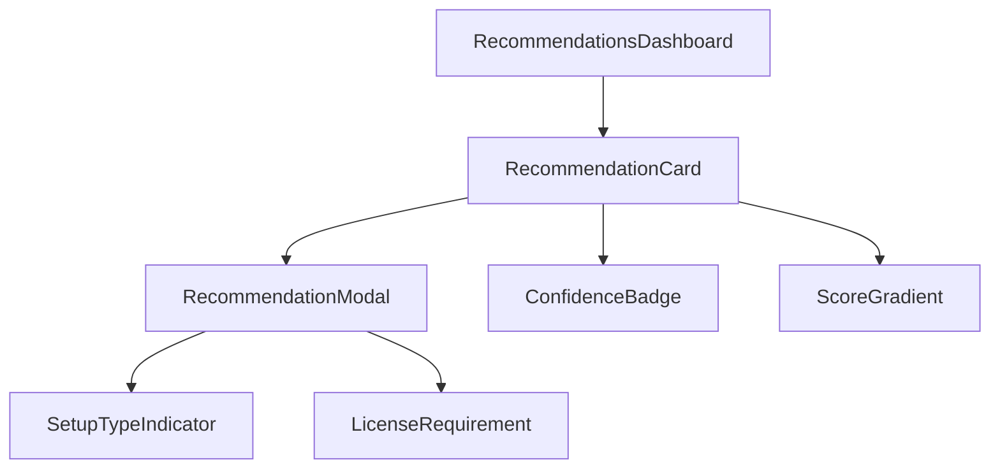

# Design Document

## Overview

This design addresses critical improvements to the recommendations system, focusing on accurate 5-category license handling, enhanced UI/UX interactions, and improved recommendation accuracy. The solution involves database schema updates, license mapping corrections, UI component enhancements, and filtering logic improvements.

## Architecture

### License System Architecture



### UI Component Hierarchy



## Components and Interfaces

### License Category System

**Updated License Categories:**
```typescript
type LicenseCategory = 'oval' | 'sports_car' | 'formula_car' | 'dirt_oval' | 'dirt_road';

interface LicenseClass {
  category: LicenseCategory;
  level: LicenseLevel;
  safetyRating: number;
  iRating: number;
}
```

**License Mapping Updates:**
```typescript
function mapLicenseCategory(categoryId: number | string): LicenseCategory {
  const id = typeof categoryId === 'string' ? parseInt(categoryId, 10) : categoryId;
  switch (id) {
    case 1: return 'oval';
    case 2: return 'sports_car'; // Legacy road -> sports_car
    case 3: return 'dirt_oval';
    case 4: return 'dirt_road';
    case 5: return 'sports_car'; // Sports Car
    case 6: return 'formula_car'; // Formula Car
    default: return 'sports_car'; // Default fallback
  }
}
```

### UI Component Enhancements

**Modal Interaction Handler:**
```typescript
interface ModalProps {
  isOpen: boolean;
  onClose: () => void;
  children: React.ReactNode;
}

// Click-outside-to-close functionality
const useClickOutside = (ref: RefObject<HTMLElement>, handler: () => void) => {
  useEffect(() => {
    const handleClickOutside = (event: MouseEvent) => {
      if (ref.current && !ref.current.contains(event.target as Node)) {
        handler();
      }
    };
    document.addEventListener('mousedown', handleClickOutside);
    return () => document.removeEventListener('mousedown', handleClickOutside);
  }, [ref, handler]);
};
```

**Score Gradient System:**
```typescript
interface ScoreGradientProps {
  score: number; // 0-100
  className?: string;
}

const getScoreColor = (score: number): string => {
  // Linear interpolation between red (0) and green (100)
  const red = Math.max(0, 255 - (score * 2.55));
  const green = Math.min(255, score * 2.55);
  return `rgb(${Math.round(red)}, ${Math.round(green)}, 0)`;
};
```

**Confidence Badge Standardization:**
```typescript
interface ConfidenceBadgeProps {
  type: 'high' | 'estimated' | 'contender';
  size?: 'sm' | 'md' | 'lg';
}

const badgeStyles = {
  sm: 'px-2 py-1 text-xs',
  md: 'px-3 py-1 text-sm', 
  lg: 'px-4 py-2 text-base'
};
```

## Data Models

### Updated Database Schema

**License Classes Table:**
```sql
CREATE TABLE license_classes (
  id UUID PRIMARY KEY DEFAULT gen_random_uuid(),
  user_id UUID REFERENCES users(id) ON DELETE CASCADE,
  category VARCHAR(20) NOT NULL CHECK (category IN ('oval', 'sports_car', 'formula_car', 'dirt_oval', 'dirt_road')),
  level VARCHAR(10) NOT NULL,
  safety_rating DECIMAL(4,2) NOT NULL,
  irating INTEGER NOT NULL,
  updated_at TIMESTAMP DEFAULT NOW(),
  UNIQUE(user_id, category)
);
```

**Schedule Entries Enhancement:**
```sql
ALTER TABLE schedule_entries 
ADD COLUMN IF NOT EXISTS setup_type VARCHAR(10) DEFAULT 'open' CHECK (setup_type IN ('fixed', 'open'));
```

### License Migration Strategy

**Data Migration Plan:**
1. **Backup existing license data**
2. **Identify road licenses to split** - Query existing 'road' category licenses
3. **Determine sports_car vs formula_car** - Use series participation data or default to sports_car
4. **Update category mappings** - Modify mapLicenseCategory function
5. **Migrate database records** - Update existing records with new categories
6. **Validate migration** - Ensure all users have correct license categories

## Correctness Properties

*A property is a characteristic or behavior that should hold true across all valid executions of a system-essentially, a formal statement about what the system should do. Properties serve as the bridge between human-readable specifications and machine-verifiable correctness guarantees.*

<function_calls>
<invoke name="prework">
<parameter name="featureName">recommendations-refinements

### Property 1: Five-Category License Recognition
*For any* license data from iRacing API containing all 5 categories (oval, sports_car, formula_car, dirt_oval, dirt_road), the License_System should correctly identify and process all 5 distinct categories without merging or losing any
**Validates: Requirements 1.1, 1.2, 1.3**

### Property 2: License Category Preservation
*For any* license mapping operation, when provided with sports_car (category_id: 5) or formula_car (category_id: 6) data, the mapping function should preserve these as separate categories and not merge them into 'road'
**Validates: Requirements 8.2**

### Property 3: Modal Click-Outside Behavior
*For any* open Recommendation_Modal, when a click event occurs outside the modal boundaries, the modal should close and return to the closed state
**Validates: Requirements 2.2**

### Property 4: Modal Card Interaction
*For any* Recommendation_Card click event, the system should open the corresponding Recommendation_Modal and display the detailed information
**Validates: Requirements 2.1**

### Property 5: Score Color Interpolation
*For any* score value between 0 and 100, the Score_Gradient should calculate a solid color that correctly interpolates between red (#ef4444) at 0 and green (#22c55e) at 100
**Validates: Requirements 3.1, 3.4**

### Property 6: License Requirement Filtering
*For any* user with a set of licenses, the recommendation system should only return series where the user meets or exceeds the minimum license requirements in the appropriate category
**Validates: Requirements 7.1**

### Property 7: Five-Category Filtering
*For any* user with licenses in multiple categories from the 5-category system (oval, sports_car, formula_car, dirt_oval, dirt_road), the filtering system should evaluate eligibility across all relevant categories
**Validates: Requirements 7.5**

## Error Handling

### License Processing Errors
- **Invalid Category IDs**: Default to 'sports_car' category with logging
- **Missing License Data**: Provide empty license array with user notification
- **API Response Errors**: Retry with exponential backoff, fallback to cached data

### UI Interaction Errors
- **Modal Rendering Failures**: Display error boundary with retry option
- **Click Handler Failures**: Log error and maintain current state
- **Score Calculation Errors**: Default to neutral color with error logging

### Database Migration Errors
- **Migration Rollback**: Automatic rollback on failure with data integrity checks
- **Constraint Violations**: Skip invalid records with detailed logging
- **Performance Issues**: Batch processing with progress monitoring

## Testing Strategy

### Unit Testing
- **License mapping functions**: Test all category ID mappings
- **Score color calculations**: Test edge cases (0, 100, mid-range values)
- **Modal interaction handlers**: Test click events and state changes
- **Filtering logic**: Test license requirement validation

### Property-Based Testing
- **License category preservation**: Generate random license data, verify categories maintained
- **Score interpolation**: Generate random scores, verify color calculations
- **Filtering accuracy**: Generate random user licenses and series requirements, verify filtering
- **Modal behavior**: Generate random interaction sequences, verify state consistency

### Integration Testing
- **End-to-end license flow**: API → Processing → Storage → UI display
- **Recommendation accuracy**: Real user data → Filtering → UI presentation
- **Migration testing**: Before/after data validation with real datasets

### Visual Regression Testing
- **Score gradient appearance**: Verify solid colors vs gradients
- **Badge sizing consistency**: Compare badge dimensions across components
- **Icon standardization**: Verify emoji removal and icon consistency