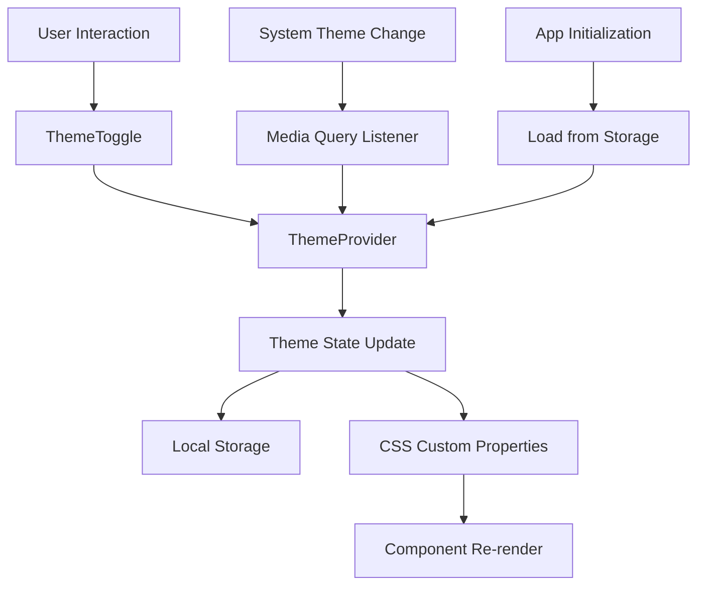

# Design Document

## Overview

The theme system will provide a comprehensive theming solution for the racing analytics dashboard, enabling users to switch between light mode, dark mode, and system preference-based theming. The system will be built using React Context, CSS custom properties, and Tailwind CSS's dark mode utilities.

## Architecture

### Core Components

1. **ThemeProvider**: React context provider that manages theme state and provides theme controls
2. **ThemeToggle**: UI component for theme selection with dropdown or segmented control interface
3. **useTheme**: Custom hook for accessing theme state and controls in components
4. **Theme Detection**: System preference detection using CSS media queries and browser APIs
5. **Theme Persistence**: Local storage integration for remembering user preferences

### Theme States

- `light`: Explicit light mode selection
- `dark`: Explicit dark mode selection  
- `system`: Automatic detection based on OS preference

### Data Flow



## Components and Interfaces

### ThemeProvider Interface

```typescript
interface ThemeContextValue {
  theme: 'light' | 'dark' | 'system';
  resolvedTheme: 'light' | 'dark';
  setTheme: (theme: 'light' | 'dark' | 'system') => void;
  systemTheme: 'light' | 'dark';
}

interface ThemeProviderProps {
  children: React.ReactNode;
  defaultTheme?: 'light' | 'dark' | 'system';
  storageKey?: string;
}
```

### ThemeToggle Interface

```typescript
interface ThemeToggleProps {
  variant?: 'dropdown' | 'segmented' | 'icon';
  size?: 'sm' | 'md' | 'lg';
  showLabels?: boolean;
  className?: string;
}
```

### useTheme Hook

```typescript
function useTheme(): ThemeContextValue {
  // Returns theme context value
  // Throws error if used outside ThemeProvider
}
```

## Data Models

### Theme Configuration

```typescript
interface ThemeConfig {
  colors: {
    background: string;
    foreground: string;
    primary: string;
    secondary: string;
    accent: string;
    muted: string;
    border: string;
    input: string;
    ring: string;
    // Status colors
    success: string;
    warning: string;
    error: string;
    info: string;
  };
  shadows: {
    sm: string;
    md: string;
    lg: string;
    xl: string;
  };
  transitions: {
    duration: string;
    timing: string;
  };
}
```

### CSS Custom Properties Structure

```css
:root {
  /* Light theme (default) */
  --background: 0 0% 100%;
  --foreground: 222.2 84% 4.9%;
  --primary: 221.2 83.2% 53.3%;
  --primary-foreground: 210 40% 98%;
  /* ... additional properties */
}

.dark {
  /* Dark theme overrides */
  --background: 222.2 84% 4.9%;
  --foreground: 210 40% 98%;
  --primary: 217.2 91.2% 59.8%;
  --primary-foreground: 222.2 84% 4.9%;
  /* ... additional properties */
}
```

## Correctness Properties

*A property is a characteristic or behavior that should hold true across all valid executions of a system-essentially, a formal statement about what the system should do. Properties serve as the bridge between human-readable specifications and machine-verifiable correctness guarantees.*

### Property 1: Theme State Consistency
*For any* theme selection action, the resolved theme should always match either the explicit selection or the detected system preference when system mode is active.
**Validates: Requirements 1.2, 1.3, 1.4**

### Property 2: Persistence Round Trip
*For any* valid theme selection, storing the preference and then loading it should produce the same theme state.
**Validates: Requirements 2.1, 2.2**

### Property 3: System Theme Synchronization
*For any* system theme change event while in system mode, the application theme should update to match the new system preference within the specified time limit.
**Validates: Requirements 1.5, 5.2**

### Property 4: CSS Property Application
*For any* theme change, all CSS custom properties should be updated to reflect the new theme values without any properties remaining from the previous theme.
**Validates: Requirements 3.1, 3.2, 3.3**

### Property 5: Component Theme Inheritance
*For any* component that uses theme-aware styling, changing the theme should result in the component reflecting the new theme's visual properties.
**Validates: Requirements 3.3, 8.1, 8.3**

### Property 6: Accessibility Preservation
*For any* theme change, all accessibility features (contrast ratios, focus indicators, screen reader compatibility) should remain compliant with WCAG 2.1 AA standards.
**Validates: Requirements 7.1, 7.2, 7.3**

### Property 7: Performance Bounds
*For any* theme change operation, the visual transition should complete within the specified time limit without causing layout shifts.
**Validates: Requirements 6.1, 6.2, 6.3**

### Property 8: Fallback Behavior
*For any* system theme detection failure or storage unavailability, the system should gracefully fallback to light mode without throwing errors.
**Validates: Requirements 2.4, 5.3, 5.4**

## Error Handling

### Theme Detection Failures
- Graceful fallback to light mode when system theme detection fails
- User notification for unsupported browsers
- Retry mechanism for transient detection failures

### Storage Failures
- Fallback to system mode when local storage is unavailable
- Silent degradation without breaking functionality
- Error logging for debugging purposes

### CSS Loading Failures
- Fallback to browser default styles
- Progressive enhancement approach
- Error boundaries to prevent theme failures from crashing the app

## Testing Strategy

### Unit Tests
- Theme state management logic
- Local storage integration
- CSS custom property updates
- Component theme inheritance
- Error handling scenarios

### Property-Based Tests
- Theme consistency across state changes (Property 1)
- Persistence round-trip validation (Property 2)
- System theme synchronization timing (Property 3)
- CSS property completeness (Property 4)
- Component theme inheritance (Property 5)
- Accessibility compliance maintenance (Property 6)
- Performance bounds validation (Property 7)
- Fallback behavior correctness (Property 8)

### Integration Tests
- End-to-end theme switching workflows
- Cross-component theme consistency
- Browser compatibility testing
- Accessibility compliance testing

### Visual Regression Tests
- Screenshot comparisons for theme changes
- Component appearance validation
- Layout stability verification

## Implementation Notes

### Tailwind CSS Integration
- Utilize Tailwind's built-in dark mode support with class strategy
- Extend Tailwind config with custom theme colors
- Use CSS custom properties for dynamic color values

### Performance Considerations
- Debounce rapid theme changes
- Use CSS transitions for smooth visual changes
- Minimize DOM manipulation during theme switches
- Lazy load theme-specific assets

### Browser Compatibility
- Support for CSS custom properties (IE11+)
- Graceful degradation for older browsers
- Feature detection for system theme support

### Accessibility Features
- High contrast mode support
- Screen reader announcements for theme changes
- Keyboard navigation support
- Focus management during theme transitions