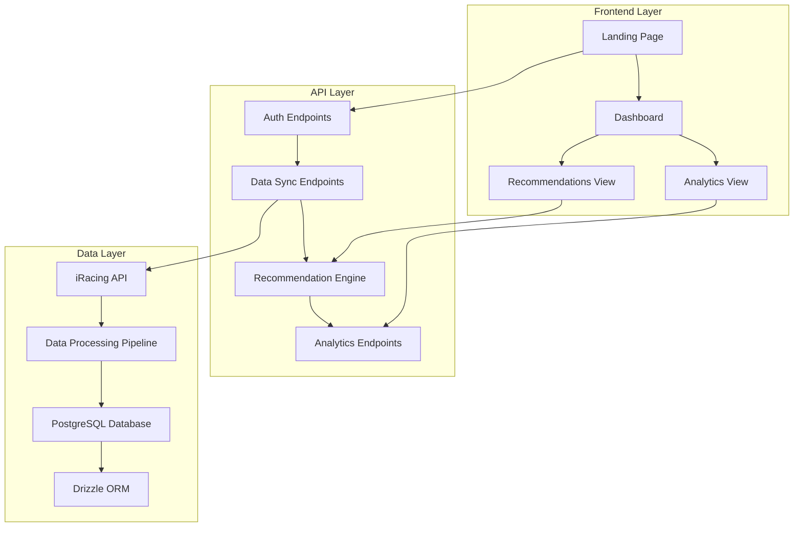
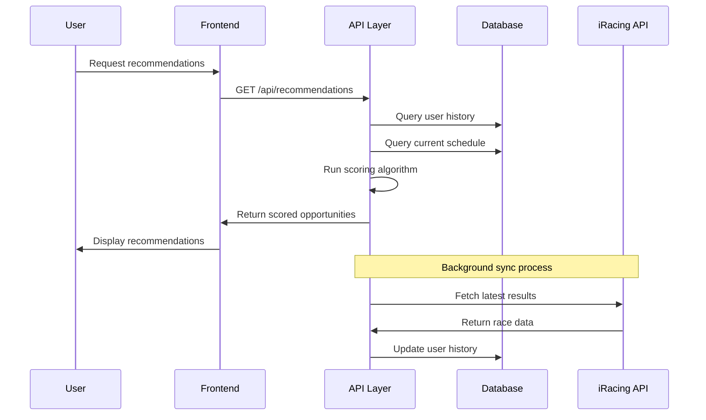

# Project Overview

## System Architecture

**Should I Race This?** is a Next.js application that provides data-driven racing recommendations for iRacing drivers. The system analyzes historical performance data and current racing schedules to suggest optimal racing opportunities.

## Core Components

### Key Orchestrator Files
The system is coordinated by several main orchestrator files:

- **`src/app/layout.tsx`** - Application-wide provider coordination
- **`src/lib/recommendations/engine.ts`** - Main recommendation system orchestrator
- **`src/app/api/recommendations/route.ts`** - Primary API endpoint orchestrator
- **`src/lib/auth/hooks.ts`** - Authentication state orchestration
- **`src/lib/db/analytics.ts`** - Performance analytics orchestration

*See [Key Orchestrator Files](./10-key-orchestrator-files.md) for complete details.*

## Key Features

### 1. Intelligent Race Recommendations
- **8-Factor Scoring Algorithm**: Evaluates opportunities across performance, safety, consistency, predictability, familiarity, fatigue risk, attrition risk, and time volatility
- **Multiple Recommendation Modes**: Balanced, iRating push, and safety recovery modes
- **Confidence Levels**: High confidence (personal data), estimated (statistical modeling), no data (global averages)

### 2. Comprehensive Data Integration
- **iRacing OAuth2**: Secure authentication with PKCE flow
- **Historical Data Sync**: Automated fetching of race results and performance metrics
- **Live Schedule Integration**: Real-time racing schedule with filtering by license requirements

### 3. Advanced Analytics
- **Performance Trends**: Track progress across different series and tracks
- **Risk Assessment**: iRating and safety rating risk evaluation
- **Experience Mapping**: Identify strengths and improvement areas

## Technology Decisions

### Frontend Stack
- **Next.js 15**: App router for modern React patterns
- **TypeScript**: Type safety throughout the application
- **Tailwind CSS**: Utility-first styling with custom racing theme
- **Zustand**: Lightweight state management
- **React Query**: Server state management and caching

### Backend Architecture
- **Next.js API Routes**: Serverless functions for API endpoints
- **Drizzle ORM**: Type-safe database operations
- **PostgreSQL**: Relational database with complex queries and analytics
- **Jose**: JWT handling for session management

### Data Processing
- **Batch Processing**: Efficient handling of large datasets
- **Caching Strategy**: Multi-level caching for performance optimization
- **Statistical Analysis**: Advanced algorithms for performance prediction

## System Goals

### Primary Objectives
1. **Improve Racing Decisions**: Help drivers choose races that align with their goals
2. **Risk Management**: Provide clear risk assessment for iRating and safety
3. **Performance Optimization**: Identify opportunities for skill development
4. **Time Efficiency**: Maximize racing satisfaction per time invested

### Success Metrics
- **Recommendation Accuracy**: How often recommendations lead to positive outcomes
- **User Engagement**: Dashboard usage and feature adoption
- **Performance Improvement**: Measurable gains in user iRating/safety over time

## Data Flow Architecture

## Security & Privacy

### Authentication Security
- **OAuth2 with PKCE**: Industry-standard secure authentication
- **Signed Session Cookies**: HttpOnly, secure session management
- **Token Refresh**: Automatic token renewal without user intervention

### Data Privacy
- **No Third-Party Sharing**: User data remains within the application
- **Minimal Data Collection**: Only racing-relevant data is stored
- **User Control**: Users can delete their data at any time

## Performance Considerations

### Optimization Strategies
- **Database Indexing**: Optimized queries for large datasets
- **Caching Layers**: Redis-compatible caching for frequently accessed data
- **Batch Processing**: Efficient handling of bulk operations
- **Lazy Loading**: Progressive data loading in the frontend

### Scalability Design
- **Stateless Architecture**: Serverless functions for horizontal scaling
- **Database Optimization**: Proper indexing and query optimization
- **CDN Integration**: Static asset optimization
- **Monitoring**: Performance tracking and alerting

---

**Next**: [Database Schema](./02-database-schema.md) - Detailed look at data models and relationships
