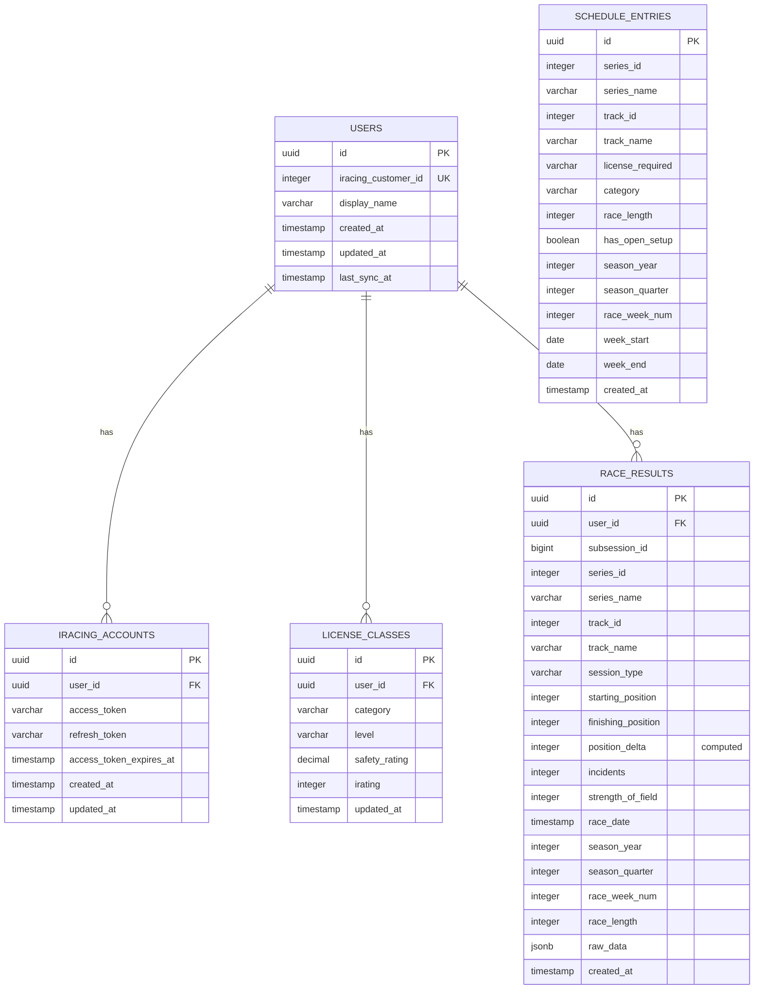

# Database Schema

## Overview

The database uses PostgreSQL with Drizzle ORM for type-safe operations. The schema is designed to efficiently store iRacing data and support complex analytics queries.

## Core Tables

### Users Table
```sql
CREATE TABLE users (
  id UUID PRIMARY KEY DEFAULT gen_random_uuid(),
  iracing_customer_id INTEGER UNIQUE NOT NULL,
  display_name VARCHAR(255) NOT NULL,
  created_at TIMESTAMP DEFAULT NOW(),
  updated_at TIMESTAMP DEFAULT NOW(),
  last_sync_at TIMESTAMP
);
```

**Purpose**: Core user identity linked to iRacing customer ID.

### iRacing Accounts Table
```sql
CREATE TABLE iracing_accounts (
  id UUID PRIMARY KEY DEFAULT gen_random_uuid(),
  user_id UUID REFERENCES users(id) ON DELETE CASCADE,
  access_token VARCHAR NOT NULL,
  refresh_token VARCHAR NOT NULL,
  access_token_expires_at TIMESTAMP NOT NULL,
  created_at TIMESTAMP DEFAULT NOW(),
  updated_at TIMESTAMP DEFAULT NOW(),
  UNIQUE(user_id)
);
```

**Purpose**: OAuth token storage with automatic refresh capability.

### License Classes Table
```sql
CREATE TABLE license_classes (
  id UUID PRIMARY KEY DEFAULT gen_random_uuid(),
  user_id UUID REFERENCES users(id) ON DELETE CASCADE,
  category VARCHAR(20) NOT NULL, -- 'oval', 'sports_car', 'formula_car', 'dirt_oval', 'dirt_road'
  level VARCHAR(10) NOT NULL,    -- 'rookie', 'D', 'C', 'B', 'A', 'pro'
  safety_rating DECIMAL(4,2) NOT NULL,
  irating INTEGER NOT NULL,
  updated_at TIMESTAMP DEFAULT NOW(),
  UNIQUE(user_id, category)
);
```

**Purpose**: Current license status across all racing categories.

### Race Results Table (Core Analytics Data)
```sql
CREATE TABLE race_results (
  id UUID PRIMARY KEY DEFAULT gen_random_uuid(),
  user_id UUID REFERENCES users(id) ON DELETE CASCADE,
  subsession_id BIGINT NOT NULL,
  series_id INTEGER NOT NULL,
  series_name VARCHAR(255) NOT NULL,
  track_id INTEGER NOT NULL,
  track_name VARCHAR(255) NOT NULL,
  session_type VARCHAR(20) NOT NULL, -- 'practice', 'qualifying', 'time_trial', 'race'
  starting_position INTEGER,
  finishing_position INTEGER,
  position_delta INTEGER GENERATED ALWAYS AS (starting_position - finishing_position),
  incidents INTEGER NOT NULL DEFAULT 0,
  strength_of_field INTEGER,
  race_date TIMESTAMP NOT NULL,
  season_year INTEGER NOT NULL,
  season_quarter INTEGER NOT NULL,
  race_week_num INTEGER,
  race_length INTEGER, -- in minutes
  raw_data JSONB,
  created_at TIMESTAMP DEFAULT NOW(),
  UNIQUE(user_id, subsession_id)
);
```

**Key Features**:
- **Computed Column**: `position_delta` automatically calculated
- **Comprehensive Indexing**: Optimized for analytics queries
- **Raw Data Storage**: Full iRacing response preserved for future analysis

### Schedule Entries Table
```sql
CREATE TABLE schedule_entries (
  id UUID PRIMARY KEY DEFAULT gen_random_uuid(),
  series_id INTEGER NOT NULL,
  series_name VARCHAR(255) NOT NULL,
  track_id INTEGER NOT NULL,
  track_name VARCHAR(255) NOT NULL,
  license_required VARCHAR(10) NOT NULL,
  category VARCHAR(20) NOT NULL,
  race_length INTEGER,
  has_open_setup BOOLEAN DEFAULT FALSE,
  season_year INTEGER NOT NULL,
  season_quarter INTEGER NOT NULL,
  race_week_num INTEGER NOT NULL,
  week_start DATE NOT NULL,
  week_end DATE NOT NULL,
  created_at TIMESTAMP DEFAULT NOW(),
  UNIQUE(series_id, track_id, season_year, season_quarter, race_week_num)
);
```

**Purpose**: Current racing schedule for recommendation filtering.

## Database Relationships



## Performance Optimizations

### Strategic Indexing
```sql
-- Race results performance indexes
CREATE INDEX idx_race_results_user_series ON race_results(user_id, series_id);
CREATE INDEX idx_race_results_user_track ON race_results(user_id, track_id);
CREATE INDEX idx_race_results_date ON race_results(race_date);
CREATE INDEX idx_race_results_season ON race_results(season_year, season_quarter);
CREATE INDEX idx_race_results_user_season ON race_results(user_id, season_year, season_quarter);
CREATE INDEX idx_race_results_subsession ON race_results(subsession_id);

-- Schedule entries indexes
CREATE INDEX idx_schedule_entries_season ON schedule_entries(season_year, season_quarter, race_week_num);
CREATE INDEX idx_schedule_entries_week ON schedule_entries(week_start, week_end);
CREATE INDEX idx_schedule_entries_series_track ON schedule_entries(series_id, track_id);
```

### Query Patterns

#### User Performance Analysis
```sql
-- Series-track specific performance
SELECT 
  series_id,
  track_id,
  COUNT(*) as race_count,
  AVG(position_delta) as avg_position_delta,
  AVG(incidents) as avg_incidents,
  STDDEV(finishing_position) as consistency
FROM race_results 
WHERE user_id = $1 
  AND series_id = $2 
  AND track_id = $3
  AND session_type = 'race'
GROUP BY series_id, track_id;
```

#### Global Statistics
```sql
-- Series-track global averages
SELECT 
  series_id,
  track_id,
  AVG(incidents) as avg_incidents,
  AVG(strength_of_field) as avg_sof,
  STDDEV(finishing_position) as field_consistency
FROM race_results 
WHERE series_id = $1 
  AND track_id = $2
  AND session_type = 'race'
  AND race_date >= NOW() - INTERVAL '6 months'
GROUP BY series_id, track_id;
```

## Data Types & Constraints

### Category Enums
- **Racing Categories**: `oval`, `sports_car`, `formula_car`, `dirt_oval`, `dirt_road`
- **License Levels**: `rookie`, `D`, `C`, `B`, `A`, `pro`
- **Session Types**: `practice`, `qualifying`, `time_trial`, `race`

### Data Validation
- **Safety Rating**: 0.00 to 5.00+ (decimal precision)
- **iRating**: Positive integers, typically 800-9000+
- **Position Delta**: Can be negative (lost positions) or positive (gained positions)
- **Incidents**: Non-negative integers, typically 0-20 per race

## Migration Strategy

### Database Migrations
```typescript
// Example migration for license category updates
export async function up(db: Database) {
  await db.execute(sql`
    ALTER TABLE license_classes 
    ADD COLUMN IF NOT EXISTS category_updated_at TIMESTAMP DEFAULT NOW()
  `);
  
  // Migrate existing data
  await db.execute(sql`
    UPDATE license_classes 
    SET category = 'sports_car' 
    WHERE category = 'road'
  `);
}
```

### Data Integrity
- **Cascading Deletes**: User deletion removes all associated data
- **Unique Constraints**: Prevent duplicate race results and license entries
- **Foreign Key Constraints**: Maintain referential integrity
- **Check Constraints**: Validate enum values and ranges

---

**Next**: [API Endpoints](./03-api-endpoints.md) - Complete API reference and usage examples
