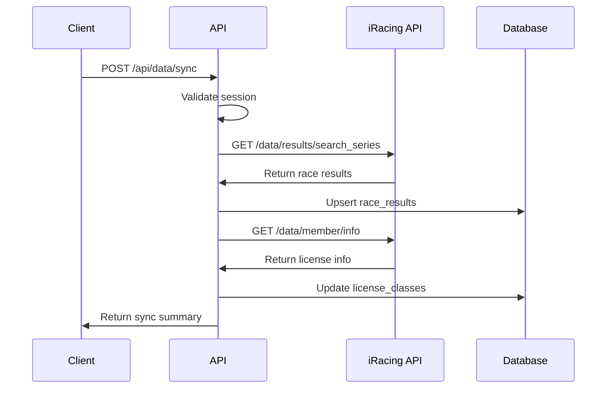

# API Endpoints

## Authentication Endpoints

### POST /api/auth/login
**Purpose**: Initiates OAuth flow with iRacing

**Flow**:
1. Generates PKCE parameters (`state`, `code_verifier`)
2. Stores parameters in signed transient cookie
3. Redirects to iRacing authorization URL

**Response**: `302 Redirect` to iRacing OAuth

```typescript
// No request body required
// Response: Redirect to iRacing OAuth with PKCE parameters
```

### POST /api/auth/exchange
**Purpose**: Exchanges OAuth code for tokens and creates user session

**Request**:
```typescript
{
  code: string;      // OAuth authorization code from iRacing
  state: string;     // PKCE state parameter
}
```

**Response**:
```typescript
{
  success: boolean;
  user: {
    id: string;
    iracingCustomerId: number;
    displayName: string;
    licenseClasses: LicenseClass[];
  };
}
```

**Process**:
1. Validates PKCE parameters
2. Exchanges code for access/refresh tokens
3. Fetches user profile from iRacing
4. Creates/updates user and license data
5. Sets signed session cookie

### GET /api/auth/me
**Purpose**: Returns current authenticated user

**Headers**: `Cookie: sirtr_session=<signed_session>`

**Response**:
```typescript
{
  user: {
    id: string;
    iracingCustomerId: number;
    displayName: string;
    licenseClasses: LicenseClass[];
  } | null;
}
```

### POST /api/auth/logout
**Purpose**: Revokes tokens and clears session

**Process**:
1. Revokes access token with iRacing
2. Clears session cookie
3. Returns success status

## Data Synchronization Endpoints

### POST /api/data/sync
**Purpose**: Syncs user's racing history from iRacing API

**Authentication**: Required (session cookie)

**Request**:
```typescript
{
  forceRefresh?: boolean;  // Skip cache, fetch fresh data
  seasonYear?: number;     // Specific season to sync
  seasonQuarter?: number;  // Specific quarter to sync
}
```

**Response**:
```typescript
{
  success: boolean;
  syncedResults: number;   // Number of new race results
  updatedLicenses: number; // Number of license updates
  lastSyncAt: string;      // ISO timestamp
  errors?: string[];       // Any non-fatal errors
}
```

**Process Flow**:


### GET /api/data/schedule
**Purpose**: Returns current racing schedule filtered by user's licenses

**Authentication**: Required

**Query Parameters**:
- `category?: string` - Filter by racing category
- `licenseLevel?: string` - Minimum license level
- `raceLength?: number` - Maximum race length in minutes

**Response**:
```typescript
{
  scheduleEntries: ScheduleEntry[];
  metadata: {
    totalEntries: number;
    filteredEntries: number;
    currentWeek: number;
    seasonInfo: {
      year: number;
      quarter: number;
    };
  };
}
```

### GET /api/data/analytics
**Purpose**: Returns user performance analytics

**Authentication**: Required

**Query Parameters**:
- `seriesId?: number` - Filter by specific series
- `trackId?: number` - Filter by specific track
- `seasonYear?: number` - Filter by season year
- `seasonQuarter?: number` - Filter by season quarter
- `limit?: number` - Limit results (default: 100)

**Response**:
```typescript
{
  performanceMetrics: {
    totalRaces: number;
    avgPositionDelta: number;
    avgIncidents: number;
    consistency: number;
    improvementTrend: 'improving' | 'stable' | 'declining';
  };
  seriesBreakdown: SeriesPerformance[];
  trackBreakdown: TrackPerformance[];
  recentResults: RaceResult[];
}
```

## Recommendation Engine Endpoints

### GET /api/recommendations
**Purpose**: Returns personalized race recommendations

**Authentication**: Required

**Query Parameters**:
- `mode?: 'balanced' | 'irating_push' | 'safety_recovery'` (default: 'balanced')
- `limit?: number` (default: 20)
- `category?: string` - Filter by racing category
- `minConfidence?: 'high' | 'estimated' | 'no_data'` (default: 'no_data')

**Response**:
```typescript
{
  recommendations: ScoredRecommendation[];
  userProfile: {
    primaryCategory: Category;
    licenseClasses: LicenseClass[];
    experienceSummary: ExperienceSummary;
  };
  metadata: {
    totalOpportunities: number;
    highConfidenceCount: number;
    estimatedCount: number;
    noDataCount: number;
    cacheStatus: 'hit' | 'miss';
    processingTimeMs: number;
  };
}
```

**Recommendation Object Structure**:
```typescript
interface ScoredRecommendation {
  // Schedule information
  seriesId: number;
  seriesName: string;
  trackId: number;
  trackName: string;
  licenseRequired: LicenseLevel;
  category: Category;
  raceLength: number;
  
  // Scoring details
  score: {
    overall: number; // 0-100
    factors: {
      performance: number;
      safety: number;
      consistency: number;
      predictability: number;
      familiarity: number;
      fatigueRisk: number;
      attritionRisk: number;
      timeVolatility: number;
    };
    iRatingRisk: 'low' | 'medium' | 'high';
    safetyRatingRisk: 'low' | 'medium' | 'high';
    reasoning: string[];
    dataConfidence: {
      performance: 'high' | 'estimated' | 'no_data';
      safety: 'high' | 'estimated' | 'no_data';
      consistency: 'high' | 'estimated' | 'no_data';
      familiarity: 'high' | 'estimated' | 'no_data';
      globalStats: 'high' | 'moderate' | 'default';
    };
  };
  
  // Visual indicators for UI
  visualIndicators: VisualScoring;
}
```

## Debug Endpoints

### GET /api/debug/user-stats
**Purpose**: Detailed user statistics for debugging

**Authentication**: Required

**Response**:
```typescript
{
  userInfo: {
    id: string;
    iracingCustomerId: number;
    displayName: string;
    lastSyncAt: string;
    totalRaces: number;
  };
  licenseBreakdown: LicenseClass[];
  performanceByCategory: CategoryPerformance[];
  recentActivity: RaceResult[];
  syncHistory: SyncEvent[];
}
```

### GET /api/debug/recommendation-details
**Purpose**: Detailed scoring breakdown for specific recommendation

**Authentication**: Required

**Query Parameters**:
- `seriesId: number` (required)
- `trackId: number` (required)
- `mode?: string` (default: 'balanced')

**Response**:
```typescript
{
  opportunity: RacingOpportunity;
  userHistory: {
    seriesTrackHistory: SeriesTrackHistory;
    overallStats: UserOverallStats;
  };
  globalStats: GlobalStats;
  scoringBreakdown: {
    factors: DetailedScoringFactors;
    weights: ModeWeights;
    calculations: ScoringCalculations;
  };
  finalScore: Score;
}
```

## Error Handling

### Standard Error Response
```typescript
{
  error: {
    code: string;           // Error code (e.g., 'AUTH_REQUIRED')
    message: string;        // Human-readable message
    details?: any;          // Additional error context
    timestamp: string;      // ISO timestamp
  };
}
```

### Common Error Codes
- `AUTH_REQUIRED`: Session cookie missing or invalid
- `TOKEN_EXPIRED`: iRacing access token needs refresh
- `IRACING_API_ERROR`: iRacing API returned error
- `INSUFFICIENT_DATA`: Not enough data for recommendations
- `RATE_LIMIT_EXCEEDED`: Too many requests
- `VALIDATION_ERROR`: Invalid request parameters

## Rate Limiting

### Limits by Endpoint
- **Authentication**: 10 requests/minute per IP
- **Data Sync**: 5 requests/minute per user
- **Recommendations**: 30 requests/minute per user
- **Analytics**: 60 requests/minute per user

### Rate Limit Headers
```
X-RateLimit-Limit: 30
X-RateLimit-Remaining: 25
X-RateLimit-Reset: 1640995200
```

## Caching Strategy

### Cache Levels
1. **Browser Cache**: Static assets and API responses
2. **Application Cache**: Recommendation results (5 minutes)
3. **Database Cache**: Aggregated statistics (1 hour)
4. **iRacing API Cache**: External API responses (15 minutes)

### Cache Headers
```
Cache-Control: public, max-age=300
ETag: "abc123"
Last-Modified: Wed, 21 Oct 2015 07:28:00 GMT
```

---

**Next**: [User Journey](./04-user-journey.md) - End-to-end user experience with flow diagrams
