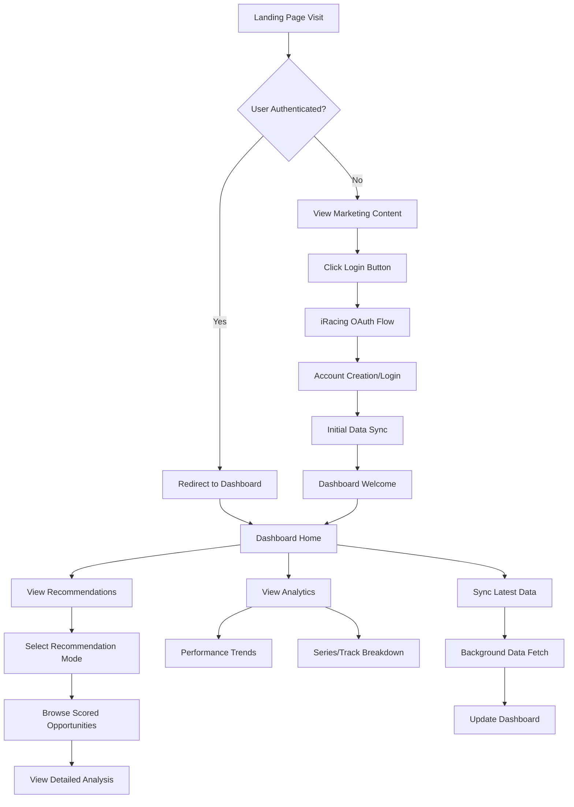
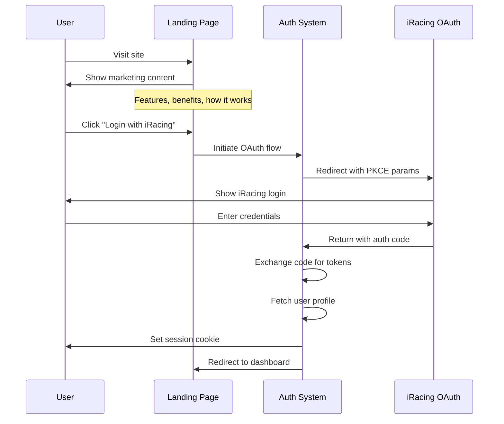
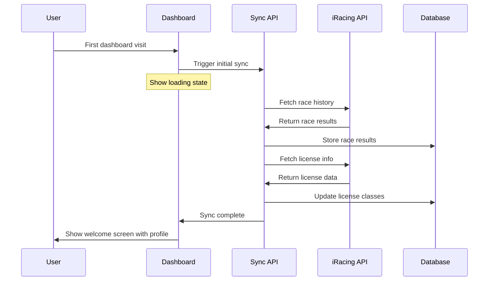
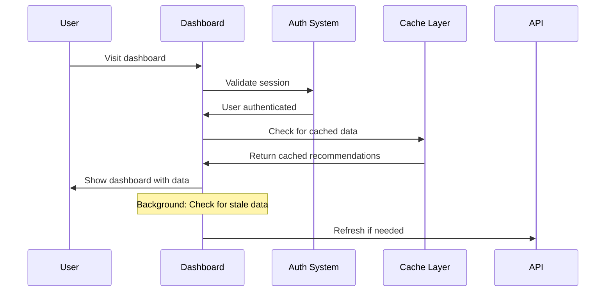
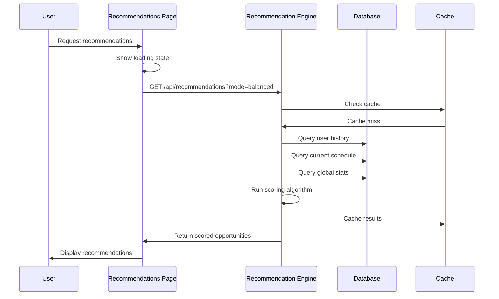
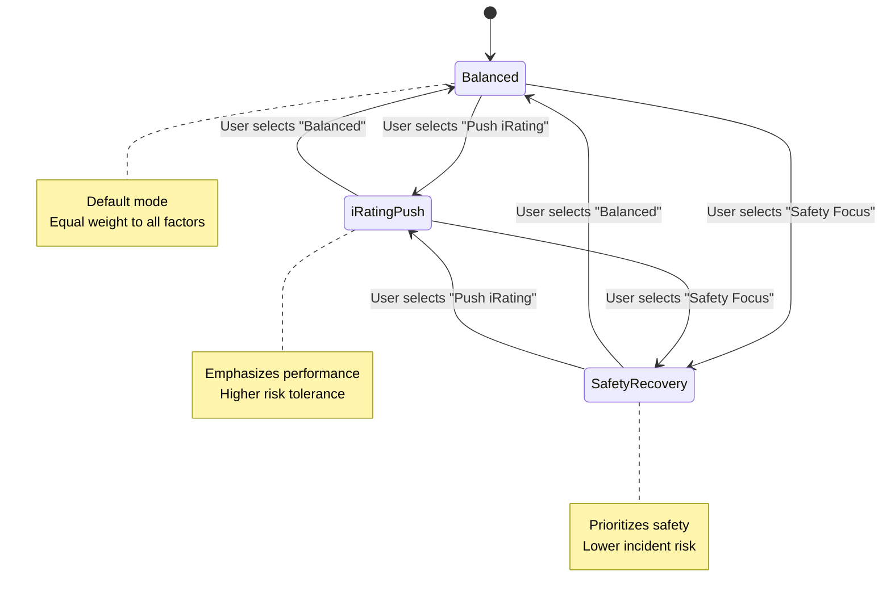
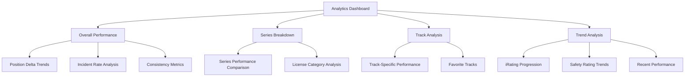
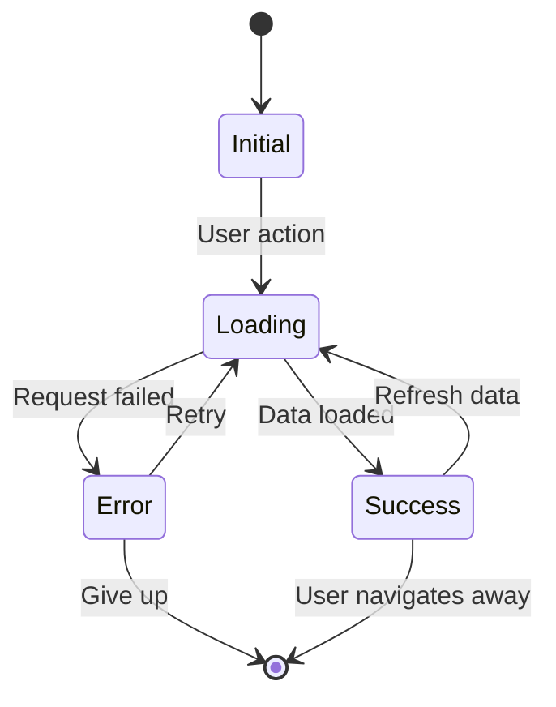
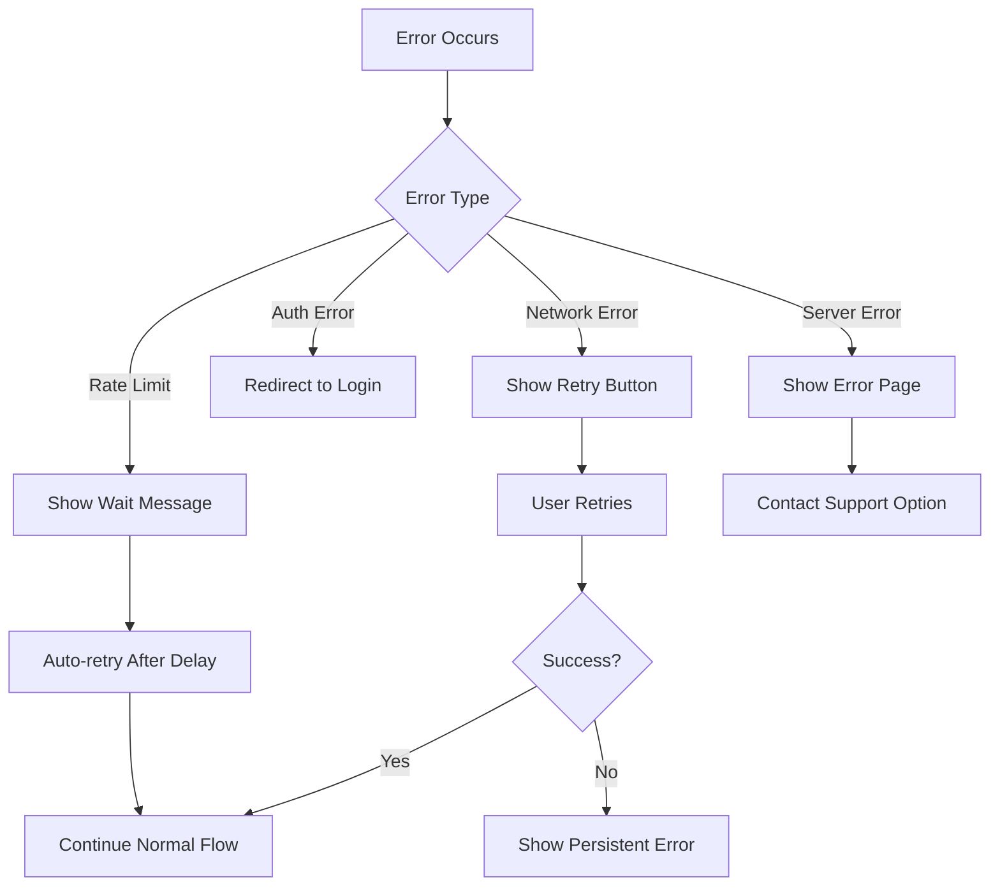
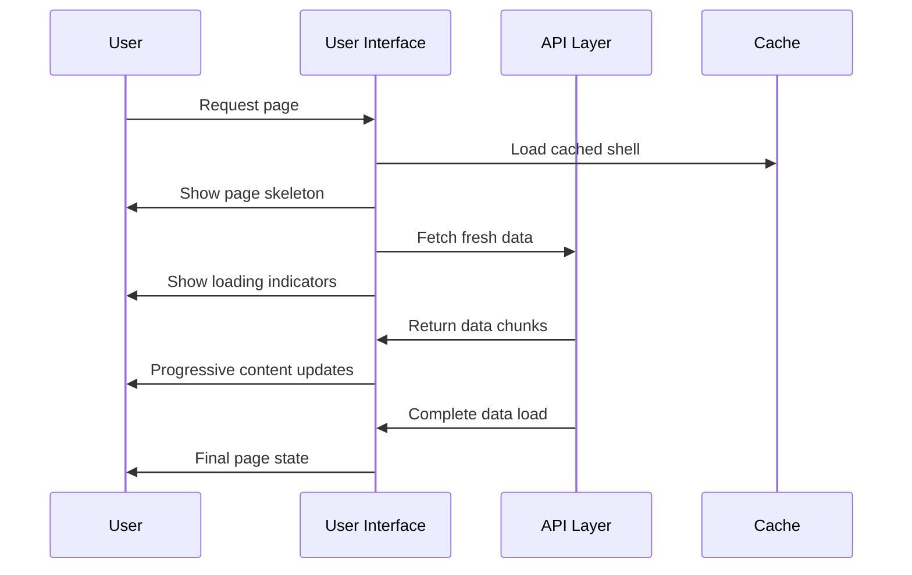

# User Journey

## Complete User Experience Flow

This document maps the end-to-end user journey from first visit to receiving personalized race recommendations.

## Journey Overview

## Detailed User Flows

### 1. First-Time User Experience

#### Landing Page Experience

#### Initial Data Sync Process

### 2. Returning User Experience

#### Dashboard Access

### 3. Recommendation Flow

#### Getting Recommendations

#### Recommendation Mode Selection

### 4. Analytics Flow

#### Performance Analysis Journey

## User Interface States

### Loading States

### Data Freshness Indicators
- **Fresh Data** (< 1 hour): Green indicator, no action needed
- **Stale Data** (1-24 hours): Yellow indicator, "Refresh" button available
- **Old Data** (> 24 hours): Red indicator, automatic refresh prompt

### Error Recovery Flows

## Mobile Experience Considerations

### Responsive Design Flow
- **Desktop**: Full dashboard with side navigation
- **Tablet**: Collapsible navigation, optimized charts
- **Mobile**: Bottom navigation, simplified views

### Touch Interactions
- **Swipe**: Navigate between recommendation cards
- **Tap**: Expand recommendation details
- **Pull-to-refresh**: Update data
- **Long press**: Access additional options

## Performance Optimization Points

### Critical User Paths
1. **Login to Dashboard**: < 3 seconds
2. **Recommendation Loading**: < 2 seconds
3. **Data Sync**: < 30 seconds (with progress)
4. **Analytics Loading**: < 1 second (cached)

### Progressive Loading Strategy

## User Feedback Loops

### Implicit Feedback
- **Click-through rates** on recommendations
- **Time spent** analyzing specific opportunities
- **Return visits** to dashboard
- **Feature usage** patterns

### Explicit Feedback
- **Recommendation ratings** (thumbs up/down)
- **Mode preference** selection frequency
- **Manual data refresh** requests
- **Support ticket** themes

## Accessibility Considerations

### Keyboard Navigation
- **Tab order**: Logical flow through interface
- **Shortcuts**: Quick access to main features
- **Focus indicators**: Clear visual feedback

### Screen Reader Support
- **Semantic HTML**: Proper heading structure
- **ARIA labels**: Descriptive element labels
- **Alt text**: Meaningful image descriptions
- **Live regions**: Dynamic content updates

### Visual Accessibility
- **Color contrast**: WCAG AA compliance
- **Font sizes**: Scalable text
- **Color independence**: Information not color-dependent
- **Motion reduction**: Respect user preferences

---

**Next**: [OAuth Integration](./05-oauth-integration.md) - Detailed iRacing authentication flow
