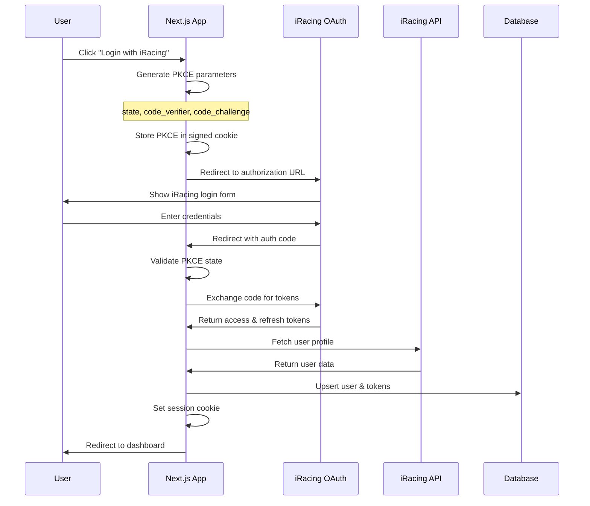
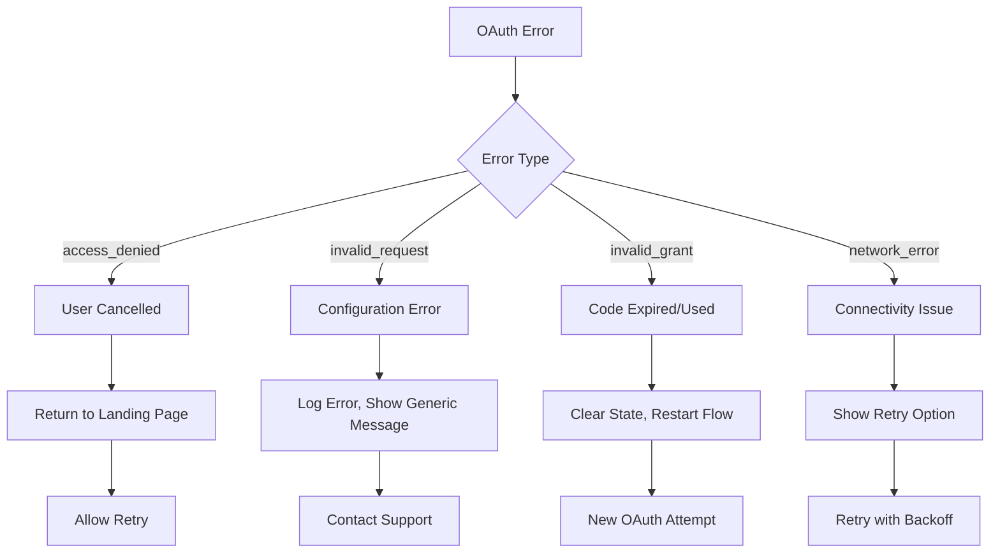

# OAuth Integration

## iRacing OAuth2 Implementation

The application uses OAuth2 with PKCE (Proof Key for Code Exchange) to securely authenticate users with their iRacing accounts.

## OAuth Flow Architecture



## PKCE Implementation Details

### Code Generation
```typescript
// Generate PKCE parameters
function generatePKCE() {
  const codeVerifier = base64URLEncode(crypto.randomBytes(32));
  const codeChallenge = base64URLEncode(
    crypto.createHash('sha256').update(codeVerifier).digest()
  );
  const state = base64URLEncode(crypto.randomBytes(16));
  
  return { codeVerifier, codeChallenge, state };
}
```

### Authorization URL Construction
```typescript
const authUrl = new URL('https://oauth.iracing.com/oauth2/authorize');
authUrl.searchParams.set('response_type', 'code');
authUrl.searchParams.set('client_id', process.env.IRACING_CLIENT_ID);
authUrl.searchParams.set('redirect_uri', process.env.IRACING_REDIRECT_URI);
authUrl.searchParams.set('scope', 'read');
authUrl.searchParams.set('state', state);
authUrl.searchParams.set('code_challenge', codeChallenge);
authUrl.searchParams.set('code_challenge_method', 'S256');
```

## Endpoint Implementation

### GET /api/auth/login
```typescript
export async function GET() {
  // Generate PKCE parameters
  const { codeVerifier, codeChallenge, state } = generatePKCE();
  
  // Store in signed transient cookie
  const oauthData = {
    state,
    codeVerifier,
    createdAt: Date.now()
  };
  
  const cookie = await signCookie('sirtr_oauth', oauthData);
  
  // Build authorization URL
  const authUrl = buildAuthorizationUrl(state, codeChallenge);
  
  return Response.redirect(authUrl, {
    headers: {
      'Set-Cookie': `sirtr_oauth=${cookie}; HttpOnly; Secure; SameSite=Lax; Max-Age=600`
    }
  });
}
```

### POST /api/auth/exchange
```typescript
export async function POST(request: Request) {
  const { code, state } = await request.json();
  
  // Validate PKCE state
  const oauthCookie = await validateOAuthCookie(request);
  if (oauthCookie.state !== state) {
    throw new Error('Invalid state parameter');
  }
  
  // Exchange code for tokens
  const tokens = await exchangeCodeForTokens(code, oauthCookie.codeVerifier);
  
  // Fetch user profile
  const profile = await fetchUserProfile(tokens.access_token);
  
  // Store user and tokens
  const user = await upsertUser(profile, tokens);
  
  // Create session
  const sessionData = {
    iracing_cust_id: user.iracingCustomerId,
    iracing_name: user.displayName,
    expiresAt: Date.now() + (7 * 24 * 60 * 60 * 1000) // 7 days
  };
  
  const sessionCookie = await signCookie('sirtr_session', sessionData);
  
  return Response.json({ success: true, user }, {
    headers: {
      'Set-Cookie': [
        `sirtr_session=${sessionCookie}; HttpOnly; Secure; SameSite=Lax; Max-Age=604800`,
        `sirtr_oauth=; HttpOnly; Secure; SameSite=Lax; Max-Age=0` // Clear transient cookie
      ]
    }
  });
}
```

## Token Management

### Token Storage Schema
```typescript
interface StoredTokens {
  accessToken: string;
  refreshToken: string;
  accessTokenExpiresAt: Date;
  createdAt: Date;
  updatedAt: Date;
}
```

### Automatic Token Refresh
```typescript
async function refreshTokenIfNeeded(userId: string): Promise<string> {
  const account = await getIracingAccount(userId);
  
  // Check if token expires within 5 minutes
  const expiresIn = account.accessTokenExpiresAt.getTime() - Date.now();
  if (expiresIn > 5 * 60 * 1000) {
    return account.accessToken;
  }
  
  // Refresh token
  const response = await fetch('https://oauth.iracing.com/oauth2/token', {
    method: 'POST',
    headers: { 'Content-Type': 'application/x-www-form-urlencoded' },
    body: new URLSearchParams({
      grant_type: 'refresh_token',
      refresh_token: account.refreshToken,
      client_id: process.env.IRACING_CLIENT_ID,
      client_secret: process.env.IRACING_CLIENT_SECRET,
    })
  });
  
  const tokens = await response.json();
  
  // Update stored tokens
  await updateIracingAccount(userId, {
    accessToken: tokens.access_token,
    refreshToken: tokens.refresh_token,
    accessTokenExpiresAt: new Date(Date.now() + tokens.expires_in * 1000)
  });
  
  return tokens.access_token;
}
```

## Session Management

### Session Cookie Structure
```typescript
interface SessionData {
  iracing_cust_id: number;
  iracing_name: string;
  expiresAt: number;
}
```

### Session Validation Middleware
```typescript
export async function validateSession(request: Request): Promise<User | null> {
  const cookieHeader = request.headers.get('cookie');
  if (!cookieHeader) return null;
  
  const cookies = parseCookies(cookieHeader);
  const sessionCookie = cookies.sirtr_session;
  if (!sessionCookie) return null;
  
  try {
    const sessionData = await verifyCookie(sessionCookie);
    
    // Check expiration
    if (Date.now() > sessionData.expiresAt) {
      return null;
    }
    
    // Fetch user from database
    const user = await getUserByIracingId(sessionData.iracing_cust_id);
    return user;
  } catch (error) {
    return null;
  }
}
```

## Security Considerations

### PKCE Security Benefits
- **No Client Secret**: Eliminates secret storage in frontend
- **Code Interception Protection**: Code useless without verifier
- **State Validation**: Prevents CSRF attacks
- **Time-Limited**: Short-lived transient cookies

### Cookie Security
```typescript
const cookieOptions = {
  httpOnly: true,        // Prevent XSS access
  secure: true,          // HTTPS only
  sameSite: 'Lax',      // CSRF protection
  maxAge: 604800,       // 7 days
  path: '/',            // Site-wide access
};
```

### Token Security
- **Encrypted Storage**: Tokens encrypted at rest
- **Automatic Refresh**: Minimizes token exposure time
- **Revocation Support**: Tokens can be revoked on logout
- **Scope Limitation**: Only 'read' scope requested

## Error Handling

### OAuth Error Responses
```typescript
interface OAuthError {
  error: string;
  error_description?: string;
  error_uri?: string;
}

// Common OAuth errors
const OAUTH_ERRORS = {
  'access_denied': 'User denied authorization',
  'invalid_request': 'Invalid OAuth request parameters',
  'invalid_client': 'Invalid client credentials',
  'invalid_grant': 'Invalid authorization code',
  'unsupported_grant_type': 'Unsupported grant type'
};
```

### Error Recovery Flow


## iRacing API Integration

### Profile Endpoint
```typescript
interface IracingProfile {
  cust_id: number;
  display_name: string;
  first_name: string;
  last_name: string;
  email: string;
  member_since: string;
  last_login: string;
  read_comp_rules: string;
  read_pp: string;
  read_tos: string;
}
```

### License Information Sync
```typescript
async function syncLicenseClasses(userId: string, accessToken: string) {
  const response = await fetch('https://members-ng.iracing.com/data/member/info', {
    headers: {
      'Authorization': `Bearer ${accessToken}`
    }
  });
  
  const data = await response.json();
  const licenses = data.licenses;
  
  // Update license classes in database
  for (const license of licenses) {
    await upsertLicenseClass(userId, {
      category: mapCategory(license.category_id),
      level: mapLicenseLevel(license.license_level),
      safetyRating: license.safety_rating,
      iRating: license.irating
    });
  }
}
```

## Testing OAuth Flow

### Development Environment
```bash
# Environment variables for testing
IRACING_CLIENT_ID=your_test_client_id
IRACING_CLIENT_SECRET=your_test_client_secret
IRACING_REDIRECT_URI=http://localhost:3000/api/auth/callback
SESSION_SECRET=your_session_secret_key
```

### OAuth Flow Testing
```typescript
// Test PKCE generation
describe('PKCE Generation', () => {
  it('should generate valid PKCE parameters', () => {
    const { codeVerifier, codeChallenge, state } = generatePKCE();
    
    expect(codeVerifier).toHaveLength(43); // Base64URL encoded 32 bytes
    expect(codeChallenge).toHaveLength(43); // SHA256 hash, Base64URL encoded
    expect(state).toHaveLength(22); // Base64URL encoded 16 bytes
  });
});

// Test token exchange
describe('Token Exchange', () => {
  it('should exchange valid code for tokens', async () => {
    const mockCode = 'test_auth_code';
    const mockVerifier = 'test_code_verifier';
    
    const tokens = await exchangeCodeForTokens(mockCode, mockVerifier);
    
    expect(tokens).toHaveProperty('access_token');
    expect(tokens).toHaveProperty('refresh_token');
    expect(tokens).toHaveProperty('expires_in');
  });
});
```

---

**Next**: [Recommendation System](./06-recommendation-system.md) - Core algorithm and scoring factors
