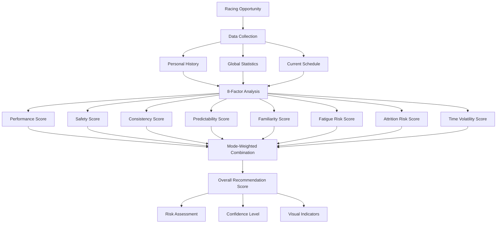
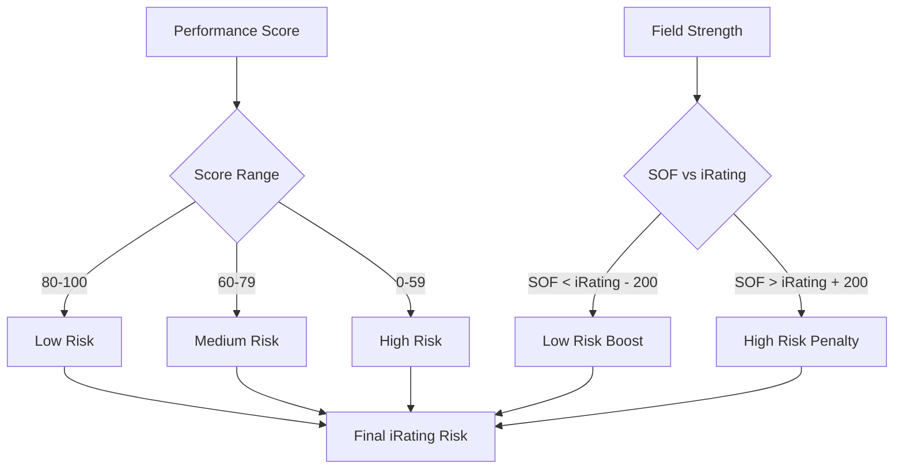
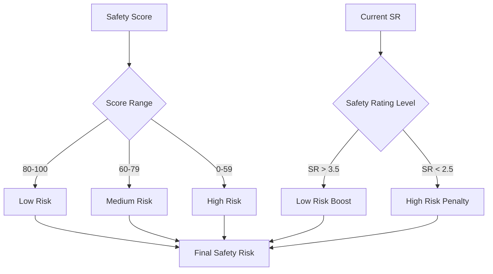
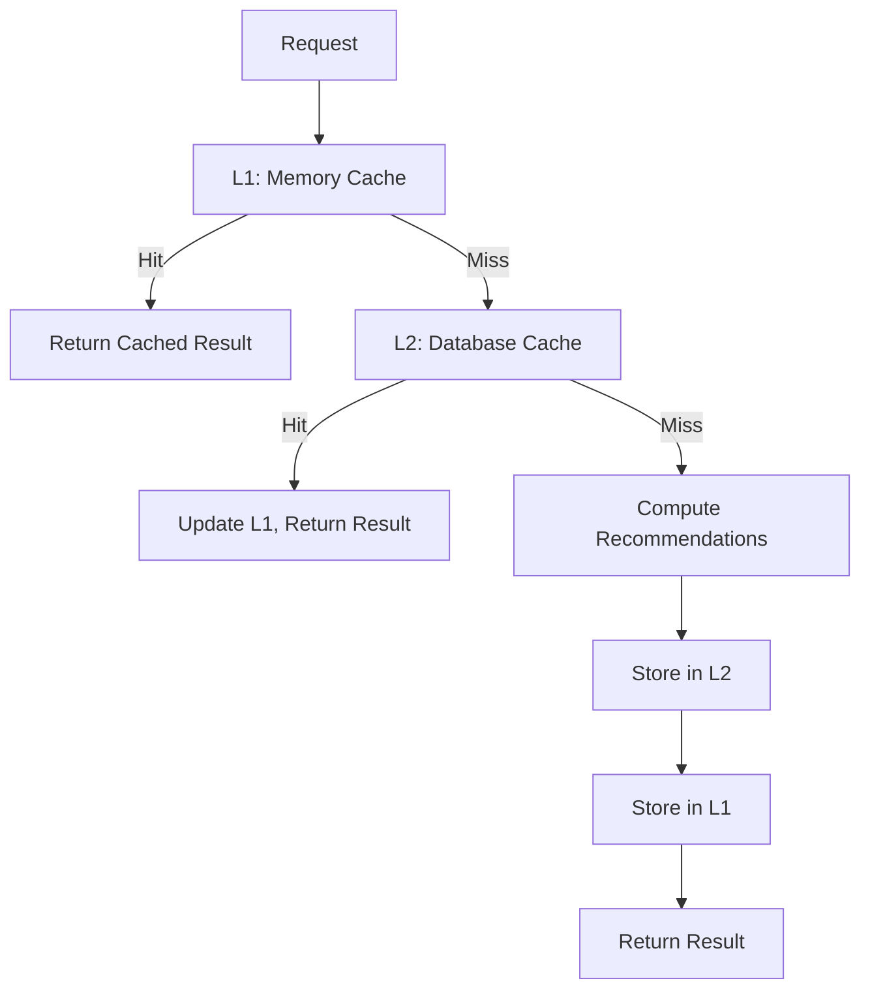

# Recommendation System

## Algorithm Overview

The recommendation engine uses an 8-factor scoring system to evaluate racing opportunities. Each factor is scored 0-100, then combined using mode-specific weights to produce personalized recommendations.

## Scoring Architecture



## The 8 Scoring Factors

### 1. Performance Score (0-100)
**Purpose**: Predicts expected finishing position relative to starting position

**Data Sources**:
- Personal series-track history (`position_delta`)
- Overall performance trends
- iRating differential vs. field strength
- License level adjustments

**Calculation**:
```typescript
function calculatePerformanceScore(
  personalHistory: SeriesTrackHistory,
  overallStats: UserOverallStats,
  opportunity: RacingOpportunity,
  userLicense: LicenseClass
): number {
  let expectedDelta: number;
  let confidence: number;
  
  if (personalHistory.raceCount >= 3) {
    // High confidence: use personal history
    expectedDelta = personalHistory.avgPositionDelta;
    confidence = Math.min(personalHistory.raceCount / 10, 1.0);
  } else {
    // Estimate based on overall performance + adjustments
    const iRatingDiff = userLicense.iRating - opportunity.globalStats.avgStrengthOfField;
    const sofAdjustment = (iRatingDiff / 200) * 1.0; // 1 position per 200 iRating
    const licenseBonus = getLicenseLevelBonus(userLicense.level);
    
    expectedDelta = overallStats.avgPositionDelta + sofAdjustment + licenseBonus;
    confidence = 0.3; // Lower confidence for estimates
  }
  
  // Normalize to 0-100 scale
  const normalizedDelta = Math.max(-10, Math.min(10, expectedDelta));
  const baseScore = ((normalizedDelta + 10) / 20) * 100;
  
  // Apply confidence weighting
  return (baseScore * confidence) + (50 * (1 - confidence));
}
```

### 2. Safety Score (0-100)
**Purpose**: Predicts incident risk based on personal and series history

**Data Sources**:
- Personal incident history
- Global series incident rates
- Safety rating adjustments
- Track-specific incident patterns

**Calculation**:
```typescript
function calculateSafetyScore(
  personalHistory: SeriesTrackHistory,
  overallStats: UserOverallStats,
  opportunity: RacingOpportunity,
  userLicense: LicenseClass
): number {
  let expectedIncidents: number;
  
  if (personalHistory.raceCount >= 3) {
    expectedIncidents = personalHistory.avgIncidents;
  } else {
    // Blend personal and global averages
    const personalWeight = Math.min(overallStats.totalRaces / 20, 0.7);
    const globalWeight = 1 - personalWeight;
    
    const safetyAdjustment = (3.0 - userLicense.safetyRating) * 0.5;
    
    expectedIncidents = 
      (overallStats.avgIncidentsPerRace * personalWeight) +
      (opportunity.globalStats.avgIncidentsPerRace * globalWeight) +
      safetyAdjustment;
  }
  
  // Normalize to 0-100 scale (lower incidents = higher score)
  const normalizedIncidents = Math.max(0, Math.min(8, expectedIncidents));
  return (1 - (normalizedIncidents / 8)) * 100;
}
```

### 3. Consistency Score (0-100)
**Purpose**: Measures finish position variability

**Data Sources**:
- Personal finish position standard deviation
- Global field consistency metrics
- Historical performance stability

**Calculation**:
```typescript
function calculateConsistencyScore(
  personalHistory: SeriesTrackHistory,
  opportunity: RacingOpportunity
): number {
  let consistency: number;
  
  if (personalHistory.raceCount >= 5) {
    consistency = personalHistory.finishPositionStdDev;
  } else {
    // Use global consistency as baseline
    consistency = opportunity.globalStats.avgFinishPositionStdDev;
  }
  
  // Lower standard deviation = higher consistency score
  const normalizedConsistency = Math.max(1, Math.min(15, consistency));
  return (1 - ((normalizedConsistency - 1) / 14)) * 100;
}
```

### 4. Predictability Score (0-100)
**Purpose**: Evaluates field strength stability

**Data Sources**:
- Strength of field variability
- Participation level consistency
- Time slot stability

**Calculation**:
```typescript
function calculatePredictabilityScore(
  opportunity: RacingOpportunity
): number {
  const sofVariability = opportunity.globalStats.strengthOfFieldVariability;
  
  // Lower variability = higher predictability
  const normalizedVariability = Math.max(50, Math.min(500, sofVariability));
  return (1 - ((normalizedVariability - 50) / 450)) * 100;
}
```

### 5. Familiarity Score (0-100)
**Purpose**: Rewards experience with series/track combinations

**Data Sources**:
- Series-specific race count
- Track-specific experience
- Recent activity levels

**Calculation**:
```typescript
function calculateFamiliarityScore(
  personalHistory: SeriesTrackHistory,
  seriesHistory: SeriesHistory,
  trackHistory: TrackHistory
): number {
  const seriesTrackRaces = personalHistory.raceCount;
  const seriesRaces = seriesHistory.totalRaces;
  const trackRaces = trackHistory.totalRaces;
  
  // Weighted combination of experience levels
  const seriesTrackWeight = 0.5;
  const seriesWeight = 0.3;
  const trackWeight = 0.2;
  
  const seriesTrackScore = Math.min(seriesTrackRaces / 10, 1.0) * 100;
  const seriesScore = Math.min(seriesRaces / 20, 1.0) * 100;
  const trackScore = Math.min(trackRaces / 15, 1.0) * 100;
  
  return (
    seriesTrackScore * seriesTrackWeight +
    seriesScore * seriesWeight +
    trackScore * trackWeight
  );
}
```

### 6. Fatigue Risk Score (0-100)
**Purpose**: Assesses time commitment and fatigue impact

**Data Sources**:
- Race length
- Time of day preferences
- Recent racing activity

**Calculation**:
```typescript
function calculateFatigueRiskScore(
  opportunity: RacingOpportunity,
  userActivity: RecentActivity
): number {
  const raceLength = opportunity.raceLength; // in minutes
  const recentRaces = userActivity.racesLastWeek;
  
  // Base fatigue from race length
  const lengthFatigue = Math.min(raceLength / 120, 1.0); // 2 hours = max
  
  // Additional fatigue from recent activity
  const activityFatigue = Math.min(recentRaces / 10, 0.5); // Max 50% penalty
  
  const totalFatigue = lengthFatigue + activityFatigue;
  
  // Higher fatigue = lower score
  return (1 - Math.min(totalFatigue, 1.0)) * 100;
}
```

### 7. Attrition Risk Score (0-100)
**Purpose**: Predicts DNF (Did Not Finish) probability

**Data Sources**:
- Global series attrition rates
- Personal DNF history
- Track-specific completion rates

**Calculation**:
```typescript
function calculateAttritionRiskScore(
  personalHistory: SeriesTrackHistory,
  opportunity: RacingOpportunity
): number {
  const globalAttritionRate = opportunity.globalStats.attritionRate;
  let personalAttritionRate: number;
  
  if (personalHistory.raceCount >= 5) {
    personalAttritionRate = personalHistory.dnfRate || 0;
  } else {
    personalAttritionRate = globalAttritionRate;
  }
  
  // Lower attrition risk = higher score
  const avgAttritionRate = (personalAttritionRate + globalAttritionRate) / 2;
  return (1 - Math.min(avgAttritionRate, 0.3)) * 100; // Cap at 30% attrition
}
```

### 8. Time Volatility Score (0-100)
**Purpose**: Evaluates participation level stability across time slots

**Data Sources**:
- Time slot participation patterns
- Field size variations
- Peak vs. off-peak differences

**Calculation**:
```typescript
function calculateTimeVolatilityScore(
  opportunity: RacingOpportunity
): number {
  const timeSlots = opportunity.timeSlots;
  
  if (timeSlots.length === 0) return 50; // Default score
  
  const participantCounts = timeSlots.map(slot => slot.participantCount);
  const avgParticipants = participantCounts.reduce((a, b) => a + b, 0) / participantCounts.length;
  
  // Calculate coefficient of variation
  const variance = participantCounts.reduce((sum, count) => {
    return sum + Math.pow(count - avgParticipants, 2);
  }, 0) / participantCounts.length;
  
  const stdDev = Math.sqrt(variance);
  const coefficientOfVariation = avgParticipants > 0 ? stdDev / avgParticipants : 0;
  
  // Lower volatility = higher score
  return (1 - Math.min(coefficientOfVariation, 1.0)) * 100;
}
```

## Recommendation Modes

### Mode-Specific Weights
```typescript
const MODE_WEIGHTS: Record<RecommendationMode, ModeWeights> = {
  balanced: {
    performance: 0.15,
    safety: 0.15,
    consistency: 0.15,
    predictability: 0.10,
    familiarity: 0.15,
    fatigueRisk: 0.10,
    attritionRisk: 0.10,
    timeVolatility: 0.10
  },
  
  irating_push: {
    performance: 0.25,      // Higher weight on performance
    safety: 0.10,          // Lower safety priority
    consistency: 0.10,
    predictability: 0.15,   // Want predictable fields
    familiarity: 0.20,     // Stick to known series/tracks
    fatigueRisk: 0.05,     // Less concerned about fatigue
    attritionRisk: 0.10,
    timeVolatility: 0.05
  },
  
  safety_recovery: {
    performance: 0.05,      // Less focus on winning
    safety: 0.30,          // Primary focus on safety
    consistency: 0.20,     // Want consistent results
    predictability: 0.15,  // Avoid chaotic fields
    familiarity: 0.15,     // Stick to comfort zone
    fatigueRisk: 0.05,
    attritionRisk: 0.05,   // Avoid DNF risk
    timeVolatility: 0.05
  }
};
```

### Overall Score Calculation
```typescript
function calculateOverallScore(
  factors: ScoringFactors,
  mode: RecommendationMode
): number {
  const weights = MODE_WEIGHTS[mode];
  
  return (
    factors.performance * weights.performance +
    factors.safety * weights.safety +
    factors.consistency * weights.consistency +
    factors.predictability * weights.predictability +
    factors.familiarity * weights.familiarity +
    factors.fatigueRisk * weights.fatigueRisk +
    factors.attritionRisk * weights.attritionRisk +
    factors.timeVolatility * weights.timeVolatility
  );
}
```

## Risk Assessment

### iRating Risk Calculation


### Safety Rating Risk Calculation


## Confidence Levels

### Data Confidence Assessment
```typescript
function assessDataConfidence(
  personalHistory: SeriesTrackHistory,
  overallStats: UserOverallStats,
  globalStats: GlobalStats
): DataConfidence {
  return {
    performance: personalHistory.raceCount >= 3 ? 'high' : 
                personalHistory.raceCount >= 1 ? 'estimated' : 'no_data',
    
    safety: personalHistory.raceCount >= 3 ? 'high' : 
           overallStats.totalRaces >= 10 ? 'estimated' : 'no_data',
    
    consistency: personalHistory.raceCount >= 5 ? 'high' : 
                personalHistory.raceCount >= 2 ? 'estimated' : 'no_data',
    
    familiarity: personalHistory.raceCount > 0 ? 'high' : 'no_data',
    
    globalStats: globalStats.sampleSize >= 100 ? 'high' : 
                globalStats.sampleSize >= 20 ? 'moderate' : 'default'
  };
}
```

## Caching Strategy

### Multi-Level Caching


### Cache Keys and TTL
```typescript
const CACHE_CONFIG = {
  recommendations: {
    keyPattern: 'rec:{userId}:{mode}:{hash}',
    ttl: 300, // 5 minutes
  },
  userStats: {
    keyPattern: 'stats:{userId}',
    ttl: 3600, // 1 hour
  },
  globalStats: {
    keyPattern: 'global:{seriesId}:{trackId}',
    ttl: 7200, // 2 hours
  },
  schedule: {
    keyPattern: 'schedule:{seasonYear}:{seasonQuarter}:{week}',
    ttl: 1800, // 30 minutes
  }
};
```

---

**Next**: [Data Processing Pipeline](./07-data-processing.md) - How iRacing data becomes recommendations
