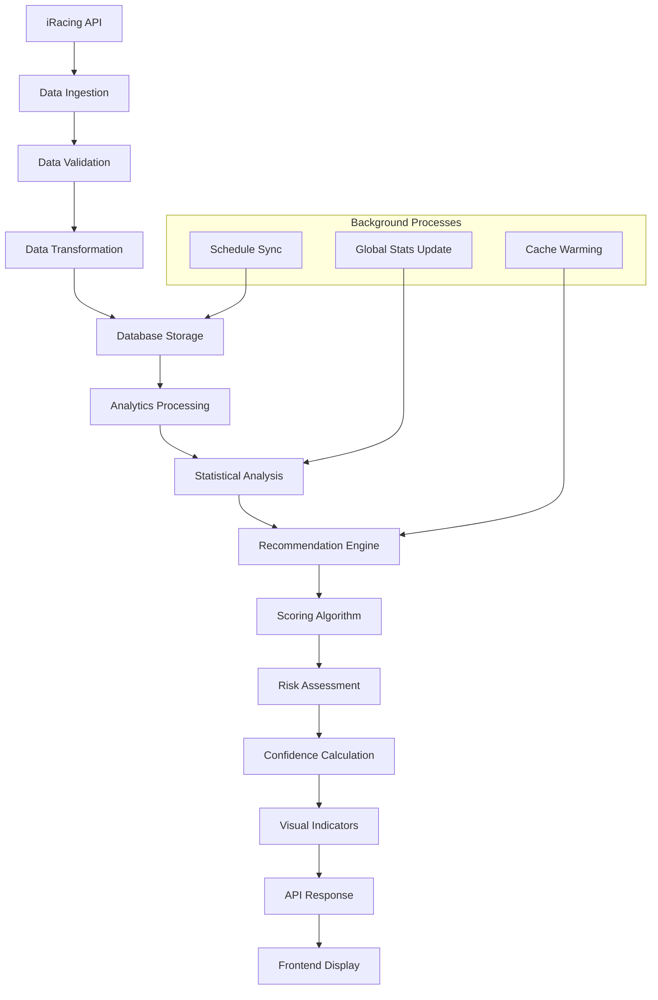
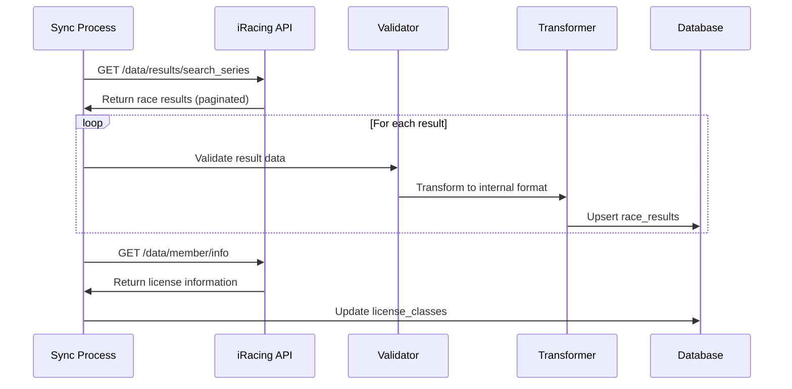
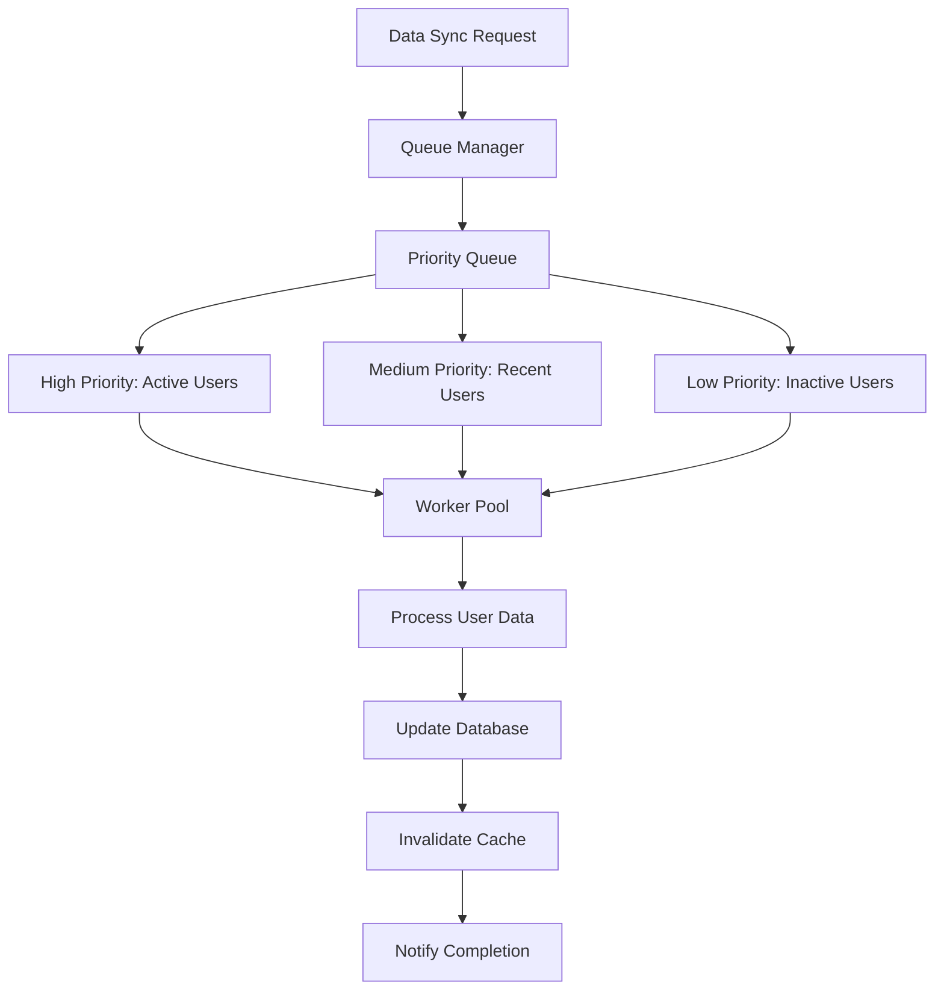

# Data Processing Pipeline

## Overview

The data processing pipeline transforms raw iRacing API data into actionable recommendations through multiple stages of analysis, aggregation, and scoring.

## Pipeline Architecture



## Data Ingestion Process

### Race Results Ingestion


### Data Validation Rules
```typescript
interface ValidationRules {
  raceResult: {
    required: ['subsession_id', 'series_id', 'track_id', 'race_date'];
    types: {
      subsession_id: 'number';
      starting_position: 'number | null';
      finishing_position: 'number | null';
      incidents: 'number';
      strength_of_field: 'number | null';
    };
    ranges: {
      incidents: [0, 50];
      starting_position: [1, 60];
      finishing_position: [1, 60];
      strength_of_field: [500, 10000];
    };
  };
}

function validateRaceResult(data: any): RaceResult {
  // Type validation
  if (typeof data.subsession_id !== 'number') {
    throw new ValidationError('Invalid subsession_id');
  }
  
  // Range validation
  if (data.incidents < 0 || data.incidents > 50) {
    throw new ValidationError('Incidents out of valid range');
  }
  
  // Business logic validation
  if (data.starting_position && data.finishing_position) {
    if (data.starting_position < 1 || data.finishing_position < 1) {
      throw new ValidationError('Invalid position values');
    }
  }
  
  return data as RaceResult;
}
```

### Data Transformation Pipeline
```typescript
class DataTransformer {
  transformRaceResult(rawData: IracingRaceResult): RaceResult {
    return {
      subsessionId: rawData.subsession_id,
      seriesId: rawData.series_id,
      seriesName: this.cleanSeriesName(rawData.series_name),
      trackId: rawData.track.track_id,
      trackName: this.cleanTrackName(rawData.track.track_name),
      sessionType: this.mapSessionType(rawData.event_type),
      startingPosition: rawData.starting_position || null,
      finishingPosition: rawData.finishing_position || null,
      incidents: rawData.incidents || 0,
      strengthOfField: rawData.event_strength_of_field || null,
      raceDate: new Date(rawData.session_start_time),
      seasonYear: rawData.season_year,
      seasonQuarter: rawData.season_quarter,
      raceWeekNum: rawData.race_week_num,
      raceLength: this.calculateRaceLength(rawData),
      rawData: rawData // Preserve original for future analysis
    };
  }
  
  private mapSessionType(eventType: number): SessionType {
    const mapping: Record<number, SessionType> = {
      2: 'practice',
      3: 'qualifying', 
      4: 'time_trial',
      5: 'race'
    };
    return mapping[eventType] || 'race';
  }
  
  private calculateRaceLength(rawData: IracingRaceResult): number {
    if (rawData.session_start_time && rawData.session_end_time) {
      const start = new Date(rawData.session_start_time);
      const end = new Date(rawData.session_end_time);
      return Math.round((end.getTime() - start.getTime()) / (1000 * 60));
    }
    return rawData.race_summary?.laps_complete * 2 || 30; // Estimate
  }
}
```

## Analytics Processing

### User Performance Analysis
```typescript
class PerformanceAnalyzer {
  async analyzeUserPerformance(userId: string): Promise<UserAnalytics> {
    const results = await this.getUserRaceResults(userId);
    
    return {
      overall: this.calculateOverallStats(results),
      bySeries: this.groupBySeries(results),
      byTrack: this.groupByTrack(results),
      byCategory: this.groupByCategory(results),
      trends: this.calculateTrends(results),
      consistency: this.calculateConsistency(results)
    };
  }
  
  private calculateOverallStats(results: RaceResult[]): OverallStats {
    const raceResults = results.filter(r => r.sessionType === 'race');
    
    return {
      totalRaces: raceResults.length,
      avgPositionDelta: this.average(raceResults.map(r => r.positionDelta || 0)),
      avgIncidents: this.average(raceResults.map(r => r.incidents)),
      avgStartingPosition: this.average(raceResults.map(r => r.startingPosition || 0)),
      avgFinishingPosition: this.average(raceResults.map(r => r.finishingPosition || 0)),
      consistency: this.standardDeviation(raceResults.map(r => r.finishingPosition || 0)),
      improvementTrend: this.calculateTrend(raceResults)
    };
  }
  
  private groupBySeries(results: RaceResult[]): SeriesPerformance[] {
    const grouped = this.groupBy(results, 'seriesId');
    
    return Object.entries(grouped).map(([seriesId, seriesResults]) => ({
      seriesId: parseInt(seriesId),
      seriesName: seriesResults[0].seriesName,
      raceCount: seriesResults.length,
      avgPositionDelta: this.average(seriesResults.map(r => r.positionDelta || 0)),
      avgIncidents: this.average(seriesResults.map(r => r.incidents)),
      consistency: this.standardDeviation(seriesResults.map(r => r.finishingPosition || 0)),
      lastRaceDate: new Date(Math.max(...seriesResults.map(r => r.raceDate.getTime()))),
      trackBreakdown: this.groupByTrack(seriesResults)
    }));
  }
}
```

### Global Statistics Computation
```typescript
class GlobalStatsProcessor {
  async computeGlobalStats(): Promise<void> {
    const seriesTrackCombos = await this.getActiveSeriesTrackCombinations();
    
    for (const combo of seriesTrackCombos) {
      const stats = await this.computeSeriesTrackStats(combo.seriesId, combo.trackId);
      await this.cacheGlobalStats(combo.seriesId, combo.trackId, stats);
    }
  }
  
  private async computeSeriesTrackStats(seriesId: number, trackId: number): Promise<GlobalStats> {
    const recentResults = await this.getRecentResults(seriesId, trackId, 6); // 6 months
    
    if (recentResults.length < 10) {
      return this.getDefaultStats();
    }
    
    return {
      avgIncidentsPerRace: this.average(recentResults.map(r => r.incidents)),
      avgFinishPositionStdDev: this.calculateFieldConsistency(recentResults),
      avgStrengthOfField: this.average(recentResults.map(r => r.strengthOfField || 0)),
      strengthOfFieldVariability: this.standardDeviation(recentResults.map(r => r.strengthOfField || 0)),
      attritionRate: this.calculateAttritionRate(recentResults),
      avgRaceLength: this.average(recentResults.map(r => r.raceLength || 0)),
      sampleSize: recentResults.length,
      lastUpdated: new Date()
    };
  }
  
  private calculateFieldConsistency(results: RaceResult[]): number {
    // Group by subsession to calculate per-race consistency
    const bySubsession = this.groupBy(results, 'subsessionId');
    
    const consistencyScores = Object.values(bySubsession).map(raceResults => {
      const finishPositions = raceResults
        .map(r => r.finishingPosition)
        .filter(pos => pos !== null) as number[];
      
      return this.standardDeviation(finishPositions);
    });
    
    return this.average(consistencyScores);
  }
}
```

## Batch Processing System

### Processing Queue Architecture


### Batch Processor Implementation
```typescript
class BatchProcessor {
  private readonly BATCH_SIZE = 50;
  private readonly MAX_CONCURRENT = 5;
  
  async processSyncQueue(): Promise<void> {
    const pendingUsers = await this.getPendingUsers();
    const batches = this.createBatches(pendingUsers, this.BATCH_SIZE);
    
    for (const batch of batches) {
      await this.processBatch(batch);
    }
  }
  
  private async processBatch(users: User[]): Promise<void> {
    const promises = users.map(user => 
      this.processUserWithRetry(user)
        .catch(error => this.handleProcessingError(user, error))
    );
    
    await Promise.allSettled(promises);
  }
  
  private async processUserWithRetry(user: User, maxRetries = 3): Promise<void> {
    for (let attempt = 1; attempt <= maxRetries; attempt++) {
      try {
        await this.syncUserData(user);
        return;
      } catch (error) {
        if (attempt === maxRetries) throw error;
        
        const delay = Math.pow(2, attempt) * 1000; // Exponential backoff
        await this.sleep(delay);
      }
    }
  }
  
  private async syncUserData(user: User): Promise<void> {
    const accessToken = await this.refreshTokenIfNeeded(user.id);
    
    // Sync race results
    const results = await this.fetchUserResults(user.iracingCustomerId, accessToken);
    await this.storeRaceResults(user.id, results);
    
    // Sync license information
    const licenses = await this.fetchUserLicenses(user.iracingCustomerId, accessToken);
    await this.updateLicenseClasses(user.id, licenses);
    
    // Update sync timestamp
    await this.updateLastSyncTime(user.id);
  }
}
```

## Real-time Processing

### Stream Processing for Live Updates
```typescript
class StreamProcessor {
  private eventStream: EventEmitter;
  
  constructor() {
    this.eventStream = new EventEmitter();
    this.setupEventHandlers();
  }
  
  private setupEventHandlers(): void {
    this.eventStream.on('raceResult', this.handleRaceResult.bind(this));
    this.eventStream.on('licenseUpdate', this.handleLicenseUpdate.bind(this));
    this.eventStream.on('scheduleChange', this.handleScheduleChange.bind(this));
  }
  
  private async handleRaceResult(event: RaceResultEvent): Promise<void> {
    // Update user statistics
    await this.updateUserStats(event.userId, event.result);
    
    // Invalidate recommendation cache
    await this.invalidateUserCache(event.userId);
    
    // Update global statistics if significant
    if (this.isSignificantResult(event.result)) {
      await this.updateGlobalStats(event.result.seriesId, event.result.trackId);
    }
    
    // Notify connected clients
    this.notifyClients(event.userId, 'statsUpdated');
  }
  
  private async handleLicenseUpdate(event: LicenseUpdateEvent): Promise<void> {
    await this.updateLicenseClasses(event.userId, event.licenses);
    await this.invalidateUserCache(event.userId);
    this.notifyClients(event.userId, 'licenseUpdated');
  }
}
```

## Data Quality Assurance

### Quality Metrics
```typescript
interface DataQualityMetrics {
  completeness: number;    // % of required fields populated
  accuracy: number;        // % of data passing validation
  consistency: number;     // % of data consistent across sources
  timeliness: number;      // % of data within acceptable age
  uniqueness: number;      // % of data without duplicates
}

class QualityAssurance {
  async assessDataQuality(userId: string): Promise<DataQualityMetrics> {
    const userResults = await this.getUserResults(userId);
    
    return {
      completeness: this.calculateCompleteness(userResults),
      accuracy: this.calculateAccuracy(userResults),
      consistency: this.calculateConsistency(userResults),
      timeliness: this.calculateTimeliness(userResults),
      uniqueness: this.calculateUniqueness(userResults)
    };
  }
  
  private calculateCompleteness(results: RaceResult[]): number {
    const requiredFields = ['seriesId', 'trackId', 'raceDate', 'sessionType'];
    const optionalFields = ['startingPosition', 'finishingPosition', 'incidents'];
    
    let totalFields = 0;
    let populatedFields = 0;
    
    for (const result of results) {
      totalFields += requiredFields.length + optionalFields.length;
      
      // Count required fields
      populatedFields += requiredFields.filter(field => 
        result[field as keyof RaceResult] != null
      ).length;
      
      // Count optional fields
      populatedFields += optionalFields.filter(field => 
        result[field as keyof RaceResult] != null
      ).length;
    }
    
    return totalFields > 0 ? (populatedFields / totalFields) * 100 : 0;
  }
}
```

## Performance Optimization

### Database Query Optimization
```sql
-- Optimized query for user performance analysis
WITH user_series_stats AS (
  SELECT 
    series_id,
    COUNT(*) as race_count,
    AVG(position_delta) as avg_position_delta,
    AVG(incidents) as avg_incidents,
    STDDEV(finishing_position) as consistency,
    MAX(race_date) as last_race_date
  FROM race_results 
  WHERE user_id = $1 
    AND session_type = 'race'
    AND race_date >= NOW() - INTERVAL '12 months'
  GROUP BY series_id
  HAVING COUNT(*) >= 3
),
global_series_stats AS (
  SELECT 
    series_id,
    track_id,
    AVG(incidents) as global_avg_incidents,
    AVG(strength_of_field) as global_avg_sof,
    STDDEV(finishing_position) as global_consistency
  FROM race_results 
  WHERE session_type = 'race'
    AND race_date >= NOW() - INTERVAL '6 months'
  GROUP BY series_id, track_id
  HAVING COUNT(*) >= 20
)
SELECT 
  u.*,
  g.global_avg_incidents,
  g.global_avg_sof,
  g.global_consistency
FROM user_series_stats u
LEFT JOIN global_series_stats g ON u.series_id = g.series_id;
```

### Caching Strategy Implementation
```typescript
class CacheManager {
  private memoryCache: Map<string, CacheEntry> = new Map();
  private readonly TTL_SECONDS = {
    recommendations: 300,    // 5 minutes
    userStats: 3600,        // 1 hour
    globalStats: 7200,      // 2 hours
    schedule: 1800          // 30 minutes
  };
  
  async get<T>(key: string, type: keyof typeof this.TTL_SECONDS): Promise<T | null> {
    // Check memory cache first
    const memoryEntry = this.memoryCache.get(key);
    if (memoryEntry && !this.isExpired(memoryEntry, type)) {
      return memoryEntry.data as T;
    }
    
    // Check database cache
    const dbEntry = await this.getFromDatabase(key);
    if (dbEntry && !this.isExpired(dbEntry, type)) {
      // Warm memory cache
      this.memoryCache.set(key, dbEntry);
      return dbEntry.data as T;
    }
    
    return null;
  }
  
  async set<T>(key: string, data: T, type: keyof typeof this.TTL_SECONDS): Promise<void> {
    const entry: CacheEntry = {
      data,
      timestamp: Date.now(),
      ttl: this.TTL_SECONDS[type]
    };
    
    // Store in memory cache
    this.memoryCache.set(key, entry);
    
    // Store in database cache
    await this.storeInDatabase(key, entry);
  }
  
  private isExpired(entry: CacheEntry, type: keyof typeof this.TTL_SECONDS): boolean {
    const age = (Date.now() - entry.timestamp) / 1000;
    return age > this.TTL_SECONDS[type];
  }
}
```

---

**Next**: [Pages & Components](./08-pages-components.md) - Frontend structure and key components
