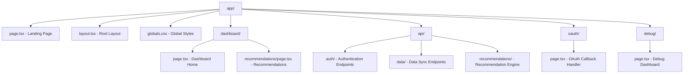

# Pages & Components

## Frontend Architecture

The frontend is built with Next.js 15 using the App Router, React 19, and TypeScript. The component architecture follows a modular design with reusable UI components and feature-specific modules.

## Page Structure



## Core Pages

### Landing Page (`/`)
**File**: `src/app/page.tsx`

**Purpose**: Marketing page and authentication entry point

**Key Features**:
- Hero section with value proposition
- Feature showcase cards
- How-it-works flow
- iRacing OAuth login button
- Responsive design with racing theme

**Component Structure**:
```typescript
export default function Home() {
  const { user, loading, login, logout } = useAuth();
  
  if (loading) return <LoadingSpinner />;
  
  if (user) {
    return <AuthenticatedWelcome user={user} />;
  }
  
  return (
    <main className="min-h-screen bg-gradient-to-br from-racing-black via-racing-gray-900 to-racing-gray-800">
      <HeroSection onLogin={login} />
      <ValuePropositionCards />
      <HowItWorksSection />
      <CallToActionSection onLogin={login} />
    </main>
  );
}
```

### Dashboard Home (`/dashboard`)
**File**: `src/app/dashboard/page.tsx`

**Purpose**: Main analytics and navigation hub

**Key Features**:
- User profile summary
- Quick stats overview
- Navigation to recommendations
- Recent activity feed
- Data sync status

**Component Breakdown**:
```typescript
export default function Dashboard() {
  const { user } = useAuth();
  const { data: analytics, isLoading } = useAnalytics();
  const { syncStatus, triggerSync } = useDataSync();
  
  return (
    <DashboardLayout>
      <DashboardHeader user={user} syncStatus={syncStatus} />
      
      <div className="grid grid-cols-1 lg:grid-cols-3 gap-6">
        <div className="lg:col-span-2">
          <PerformanceOverview analytics={analytics} />
          <RecentActivity />
        </div>
        
        <div className="space-y-6">
          <QuickStats analytics={analytics} />
          <NavigationCards />
          <SyncStatusCard onSync={triggerSync} />
        </div>
      </div>
    </DashboardLayout>
  );
}
```

### Recommendations Page (`/dashboard/recommendations`)
**File**: `src/app/dashboard/recommendations/page.tsx`

**Purpose**: Personalized race recommendations with detailed scoring

**Key Features**:
- Mode selection (Balanced, iRating Push, Safety Recovery)
- Scored opportunity cards
- Detailed scoring breakdowns
- Confidence indicators
- Filtering and sorting options

**State Management**:
```typescript
export default function Recommendations() {
  const [mode, setMode] = useState<RecommendationMode>('balanced');
  const [filters, setFilters] = useState<RecommendationFilters>({});
  
  const { 
    data: recommendations, 
    isLoading, 
    error 
  } = useRecommendations(mode, filters);
  
  return (
    <DashboardLayout>
      <RecommendationsHeader 
        mode={mode} 
        onModeChange={setMode}
        filters={filters}
        onFiltersChange={setFilters}
      />
      
      {isLoading && <RecommendationsLoading />}
      {error && <ErrorMessage error={error} />}
      
      {recommendations && (
        <RecommendationsList 
          recommendations={recommendations.recommendations}
          metadata={recommendations.metadata}
        />
      )}
    </DashboardLayout>
  );
}
```

## Component Architecture

### Layout Components

#### Root Layout (`src/app/layout.tsx`)
```typescript
export default function RootLayout({
  children,
}: {
  children: React.ReactNode;
}) {
  return (
    <html lang="en">
      <body className={inter.className}>
        <AuthProvider>
          <QueryProvider>
            <ThemeProvider>
              {children}
            </ThemeProvider>
          </QueryProvider>
        </AuthProvider>
      </body>
    </html>
  );
}
```

#### Dashboard Layout (`src/components/layouts/DashboardLayout.tsx`)
```typescript
interface DashboardLayoutProps {
  children: React.ReactNode;
}

export function DashboardLayout({ children }: DashboardLayoutProps) {
  const { user } = useAuth();
  
  return (
    <div className="min-h-screen bg-racing-gray-50">
      <DashboardNavigation user={user} />
      
      <main className="lg:pl-64">
        <div className="px-4 sm:px-6 lg:px-8 py-8">
          {children}
        </div>
      </main>
    </div>
  );
}
```

### Recommendation Components

#### Recommendation Card (`src/components/recommendations/RecommendationCard.tsx`)
```typescript
interface RecommendationCardProps {
  recommendation: ScoredRecommendation;
  onExpand: (id: string) => void;
  expanded: boolean;
}

export function RecommendationCard({ 
  recommendation, 
  onExpand, 
  expanded 
}: RecommendationCardProps) {
  const { score, seriesName, trackName, raceLength } = recommendation;
  
  return (
    <div className="card hover:shadow-lg transition-shadow">
      <CardHeader 
        title={`${seriesName} at ${trackName}`}
        score={score.overall}
        confidence={score.dataConfidence}
      />
      
      <CardContent>
        <ScoreVisualization factors={score.factors} />
        <RaceDetails 
          length={raceLength}
          license={recommendation.licenseRequired}
          category={recommendation.category}
        />
        <RiskIndicators 
          iRatingRisk={score.iRatingRisk}
          safetyRisk={score.safetyRatingRisk}
        />
      </CardContent>
      
      {expanded && (
        <CardExpanded>
          <DetailedScoring score={score} />
          <ReasoningExplanation reasoning={score.reasoning} />
        </CardExpanded>
      )}
      
      <CardFooter>
        <ExpandButton onClick={() => onExpand(recommendation.seriesId.toString())} />
        <ActionButtons recommendation={recommendation} />
      </CardFooter>
    </div>
  );
}
```

#### Score Visualization (`src/components/recommendations/ScoreVisualization.tsx`)
```typescript
interface ScoreVisualizationProps {
  factors: ScoringFactors;
  mode?: RecommendationMode;
}

export function ScoreVisualization({ factors, mode = 'balanced' }: ScoreVisualizationProps) {
  const weights = MODE_WEIGHTS[mode];
  
  return (
    <div className="space-y-3">
      {Object.entries(factors).map(([factor, score]) => (
        <FactorBar
          key={factor}
          name={factor}
          score={score}
          weight={weights[factor as keyof ModeWeights]}
          icon={getFactorIcon(factor)}
        />
      ))}
    </div>
  );
}

function FactorBar({ name, score, weight, icon }: FactorBarProps) {
  const color = getScoreColor(score);
  const displayName = formatFactorName(name);
  
  return (
    <div className="flex items-center space-x-3">
      <div className="w-6 h-6 text-racing-gray-600">
        {icon}
      </div>
      
      <div className="flex-1">
        <div className="flex justify-between text-sm mb-1">
          <span className="font-medium">{displayName}</span>
          <span className="text-racing-gray-600">{Math.round(score)}</span>
        </div>
        
        <div className="w-full bg-racing-gray-200 rounded-full h-2">
          <div 
            className={`h-2 rounded-full transition-all duration-300 ${color}`}
            style={{ width: `${score}%` }}
          />
        </div>
      </div>
      
      {weight > 0.15 && (
        <div className="text-xs text-racing-blue font-semibold">
          High Priority
        </div>
      )}
    </div>
  );
}
```

### Analytics Components

#### Performance Chart (`src/components/analytics/PerformanceChart.tsx`)
```typescript
interface PerformanceChartProps {
  data: PerformanceData[];
  metric: 'position_delta' | 'incidents' | 'irating';
  timeRange: '3m' | '6m' | '1y';
}

export function PerformanceChart({ data, metric, timeRange }: PerformanceChartProps) {
  const chartData = useMemo(() => 
    processChartData(data, metric, timeRange), 
    [data, metric, timeRange]
  );
  
  return (
    <div className="card">
      <div className="card-header">
        <h3 className="text-lg font-semibold">Performance Trend</h3>
        <MetricSelector value={metric} onChange={setMetric} />
      </div>
      
      <div className="card-content">
        <ResponsiveContainer width="100%" height={300}>
          <LineChart data={chartData}>
            <CartesianGrid strokeDasharray="3 3" />
            <XAxis dataKey="date" />
            <YAxis />
            <Tooltip content={<CustomTooltip />} />
            <Line 
              type="monotone" 
              dataKey="value" 
              stroke="#3B82F6" 
              strokeWidth={2}
            />
          </LineChart>
        </ResponsiveContainer>
      </div>
    </div>
  );
}
```

### UI Components

#### Custom Button (`src/components/ui/Button.tsx`)
```typescript
interface ButtonProps extends React.ButtonHTMLAttributes<HTMLButtonElement> {
  variant?: 'primary' | 'secondary' | 'danger';
  size?: 'sm' | 'md' | 'lg';
  loading?: boolean;
}

export function Button({ 
  variant = 'primary', 
  size = 'md', 
  loading = false,
  children,
  className,
  disabled,
  ...props 
}: ButtonProps) {
  const baseClasses = 'inline-flex items-center justify-center font-medium rounded-lg transition-colors focus:outline-none focus:ring-2 focus:ring-offset-2';
  
  const variantClasses = {
    primary: 'bg-racing-blue text-white hover:bg-racing-blue-dark focus:ring-racing-blue',
    secondary: 'bg-racing-gray-200 text-racing-gray-900 hover:bg-racing-gray-300 focus:ring-racing-gray-500',
    danger: 'bg-racing-red text-white hover:bg-racing-red-dark focus:ring-racing-red'
  };
  
  const sizeClasses = {
    sm: 'px-3 py-1.5 text-sm',
    md: 'px-4 py-2 text-base',
    lg: 'px-6 py-3 text-lg'
  };
  
  const classes = cn(
    baseClasses,
    variantClasses[variant],
    sizeClasses[size],
    (disabled || loading) && 'opacity-50 cursor-not-allowed',
    className
  );
  
  return (
    <button 
      className={classes} 
      disabled={disabled || loading}
      {...props}
    >
      {loading && <Spinner className="w-4 h-4 mr-2" />}
      {children}
    </button>
  );
}
```

#### Progress Bar (`src/components/ui/ProgressBar.tsx`)
```typescript
interface ProgressBarProps {
  value: number; // 0-100
  max?: number;
  color?: 'blue' | 'green' | 'yellow' | 'red';
  size?: 'sm' | 'md' | 'lg';
  showLabel?: boolean;
  label?: string;
}

export function ProgressBar({ 
  value, 
  max = 100, 
  color = 'blue', 
  size = 'md',
  showLabel = false,
  label 
}: ProgressBarProps) {
  const percentage = Math.min((value / max) * 100, 100);
  
  const colorClasses = {
    blue: 'bg-racing-blue',
    green: 'bg-racing-green',
    yellow: 'bg-racing-yellow',
    red: 'bg-racing-red'
  };
  
  const sizeClasses = {
    sm: 'h-1',
    md: 'h-2',
    lg: 'h-3'
  };
  
  return (
    <div className="w-full">
      {showLabel && (
        <div className="flex justify-between text-sm mb-1">
          <span>{label}</span>
          <span>{Math.round(value)}</span>
        </div>
      )}
      
      <div className={`w-full bg-racing-gray-200 rounded-full ${sizeClasses[size]}`}>
        <div 
          className={`${sizeClasses[size]} rounded-full transition-all duration-300 ${colorClasses[color]}`}
          style={{ width: `${percentage}%` }}
        />
      </div>
    </div>
  );
}
```

## State Management

### Authentication Hook (`src/lib/auth/hooks.ts`)
```typescript
export function useAuth() {
  const [user, setUser] = useState<User | null>(null);
  const [loading, setLoading] = useState(true);
  
  useEffect(() => {
    checkAuthStatus();
  }, []);
  
  const checkAuthStatus = async () => {
    try {
      const response = await fetch('/api/auth/me');
      if (response.ok) {
        const data = await response.json();
        setUser(data.user);
      }
    } catch (error) {
      console.error('Auth check failed:', error);
    } finally {
      setLoading(false);
    }
  };
  
  const login = () => {
    window.location.href = '/api/auth/login';
  };
  
  const logout = async () => {
    try {
      await fetch('/api/auth/logout', { method: 'POST' });
      setUser(null);
      window.location.href = '/';
    } catch (error) {
      console.error('Logout failed:', error);
    }
  };
  
  return { user, loading, login, logout, refetch: checkAuthStatus };
}
```

### Recommendations Hook (`src/lib/hooks/useRecommendations.ts`)
```typescript
export function useRecommendations(
  mode: RecommendationMode = 'balanced',
  filters: RecommendationFilters = {}
) {
  return useQuery({
    queryKey: ['recommendations', mode, filters],
    queryFn: async () => {
      const params = new URLSearchParams({
        mode,
        ...Object.fromEntries(
          Object.entries(filters).filter(([_, value]) => value != null)
        )
      });
      
      const response = await fetch(`/api/recommendations?${params}`);
      if (!response.ok) {
        throw new Error('Failed to fetch recommendations');
      }
      
      return response.json() as Promise<RecommendationResponse>;
    },
    staleTime: 5 * 60 * 1000, // 5 minutes
    cacheTime: 10 * 60 * 1000, // 10 minutes
  });
}
```

## Responsive Design

### Breakpoint Strategy
```css
/* Tailwind CSS breakpoints */
/* sm: 640px */
/* md: 768px */
/* lg: 1024px */
/* xl: 1280px */
/* 2xl: 1536px */

/* Mobile-first approach */
.recommendation-grid {
  @apply grid grid-cols-1 gap-4;
  
  /* Tablet */
  @apply md:grid-cols-2 md:gap-6;
  
  /* Desktop */
  @apply lg:grid-cols-3 lg:gap-8;
  
  /* Large desktop */
  @apply xl:grid-cols-4;
}
```

### Mobile Navigation
```typescript
export function MobileNavigation() {
  const [isOpen, setIsOpen] = useState(false);
  
  return (
    <div className="lg:hidden">
      <button 
        onClick={() => setIsOpen(!isOpen)}
        className="p-2 rounded-md text-racing-gray-600"
      >
        <MenuIcon className="w-6 h-6" />
      </button>
      
      {isOpen && (
        <div className="fixed inset-0 z-50 bg-black bg-opacity-50">
          <div className="fixed inset-y-0 left-0 w-64 bg-white shadow-lg">
            <NavigationMenu onClose={() => setIsOpen(false)} />
          </div>
        </div>
      )}
    </div>
  );
}
```

---

**Next**: [Dashboard Features](./09-dashboard-features.md) - Analytics and visualization features
