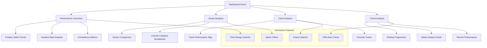

# Dashboard Features

## Analytics Dashboard Overview

The dashboard provides comprehensive racing analytics with interactive visualizations, performance tracking, and actionable insights to help drivers improve their racing performance.

## Dashboard Architecture



## Core Dashboard Components

### Performance Overview Widget
```typescript
interface PerformanceOverviewProps {
  analytics: UserAnalytics;
  timeRange: TimeRange;
}

export function PerformanceOverview({ analytics, timeRange }: PerformanceOverviewProps) {
  const metrics = useMemo(() => 
    calculateKeyMetrics(analytics, timeRange), 
    [analytics, timeRange]
  );
  
  return (
    <div className="card">
      <div className="card-header">
        <h2 className="text-xl font-bold">Performance Overview</h2>
        <TimeRangeSelector value={timeRange} onChange={setTimeRange} />
      </div>
      
      <div className="card-content">
        <div className="grid grid-cols-2 md:grid-cols-4 gap-4 mb-6">
          <MetricCard
            title="Avg Position Gain"
            value={metrics.avgPositionDelta}
            format="signed"
            trend={metrics.positionTrend}
            icon={<TrendingUpIcon />}
          />
          
          <MetricCard
            title="Incident Rate"
            value={metrics.avgIncidents}
            format="decimal"
            trend={metrics.incidentTrend}
            icon={<ShieldIcon />}
          />
          
          <MetricCard
            title="Consistency"
            value={metrics.consistency}
            format="percentage"
            trend={metrics.consistencyTrend}
            icon={<TargetIcon />}
          />
          
          <MetricCard
            title="Total Races"
            value={metrics.totalRaces}
            format="integer"
            icon={<FlagIcon />}
          />
        </div>
        
        <PerformanceTrendChart data={analytics.trends} />
      </div>
    </div>
  );
}
```

### Series Performance Analysis
```typescript
export function SeriesAnalysis({ seriesData }: { seriesData: SeriesPerformance[] }) {
  const [selectedSeries, setSelectedSeries] = useState<number | null>(null);
  const [sortBy, setSortBy] = useState<'performance' | 'races' | 'recent'>('performance');
  
  const sortedSeries = useMemo(() => {
    return [...seriesData].sort((a, b) => {
      switch (sortBy) {
        case 'performance':
          return b.avgPositionDelta - a.avgPositionDelta;
        case 'races':
          return b.raceCount - a.raceCount;
        case 'recent':
          return b.lastRaceDate.getTime() - a.lastRaceDate.getTime();
        default:
          return 0;
      }
    });
  }, [seriesData, sortBy]);
  
  return (
    <div className="card">
      <div className="card-header">
        <h2 className="text-xl font-bold">Series Performance</h2>
        <div className="flex space-x-2">
          <SortSelector value={sortBy} onChange={setSortBy} />
          <ExportButton data={seriesData} filename="series-performance" />
        </div>
      </div>
      
      <div className="card-content">
        <div className="space-y-3">
          {sortedSeries.map((series) => (
            <SeriesCard
              key={series.seriesId}
              series={series}
              selected={selectedSeries === series.seriesId}
              onClick={() => setSelectedSeries(
                selectedSeries === series.seriesId ? null : series.seriesId
              )}
            />
          ))}
        </div>
        
        {selectedSeries && (
          <SeriesDetailView 
            seriesId={selectedSeries}
            onClose={() => setSelectedSeries(null)}
          />
        )}
      </div>
    </div>
  );
}

function SeriesCard({ series, selected, onClick }: SeriesCardProps) {
  const performanceColor = getPerformanceColor(series.avgPositionDelta);
  const consistencyScore = calculateConsistencyScore(series.consistency);
  
  return (
    <div 
      className={`p-4 rounded-lg border cursor-pointer transition-all ${
        selected ? 'border-racing-blue bg-racing-blue-50' : 'border-racing-gray-200 hover:border-racing-gray-300'
      }`}
      onClick={onClick}
    >
      <div className="flex items-center justify-between">
        <div className="flex-1">
          <h3 className="font-semibold text-racing-gray-900">{series.seriesName}</h3>
          <div className="flex items-center space-x-4 mt-2 text-sm text-racing-gray-600">
            <span>{series.raceCount} races</span>
            <span>Last: {formatRelativeDate(series.lastRaceDate)}</span>
          </div>
        </div>
        
        <div className="flex items-center space-x-4">
          <div className="text-center">
            <div className={`text-lg font-bold ${performanceColor}`}>
              {formatPositionDelta(series.avgPositionDelta)}
            </div>
            <div className="text-xs text-racing-gray-500">Avg Gain</div>
          </div>
          
          <div className="text-center">
            <div className="text-lg font-bold text-racing-gray-900">
              {series.avgIncidents.toFixed(1)}
            </div>
            <div className="text-xs text-racing-gray-500">Incidents</div>
          </div>
          
          <div className="text-center">
            <div className="text-lg font-bold text-racing-green">
              {consistencyScore}%
            </div>
            <div className="text-xs text-racing-gray-500">Consistency</div>
          </div>
          
          <ChevronRightIcon className={`w-5 h-5 transition-transform ${selected ? 'rotate-90' : ''}`} />
        </div>
      </div>
    </div>
  );
}
```

### Track Performance Heatmap
```typescript
export function TrackPerformanceHeatmap({ trackData }: { trackData: TrackPerformance[] }) {
  const [metric, setMetric] = useState<'performance' | 'safety' | 'consistency'>('performance');
  const [category, setCategory] = useState<Category | 'all'>('all');
  
  const filteredData = useMemo(() => {
    return trackData.filter(track => 
      category === 'all' || track.category === category
    );
  }, [trackData, category]);
  
  const heatmapData = useMemo(() => {
    return filteredData.map(track => ({
      trackName: track.trackName,
      value: getMetricValue(track, metric),
      races: track.raceCount,
      category: track.category
    }));
  }, [filteredData, metric]);
  
  return (
    <div className="card">
      <div className="card-header">
        <h2 className="text-xl font-bold">Track Performance</h2>
        <div className="flex space-x-2">
          <MetricSelector value={metric} onChange={setMetric} />
          <CategoryFilter value={category} onChange={setCategory} />
        </div>
      </div>
      
      <div className="card-content">
        <div className="grid grid-cols-1 md:grid-cols-2 lg:grid-cols-3 gap-4">
          {heatmapData.map((track) => (
            <TrackHeatmapCell
              key={track.trackName}
              track={track}
              metric={metric}
            />
          ))}
        </div>
        
        <div className="mt-6">
          <HeatmapLegend metric={metric} />
        </div>
      </div>
    </div>
  );
}

function TrackHeatmapCell({ track, metric }: TrackHeatmapCellProps) {
  const intensity = normalizeMetricValue(track.value, metric);
  const color = getHeatmapColor(intensity);
  
  return (
    <div 
      className={`p-3 rounded-lg text-white text-center ${color}`}
      title={`${track.trackName}: ${formatMetricValue(track.value, metric)}`}
    >
      <div className="font-semibold text-sm truncate">{track.trackName}</div>
      <div className="text-lg font-bold">{formatMetricValue(track.value, metric)}</div>
      <div className="text-xs opacity-75">{track.races} races</div>
    </div>
  );
}
```

### iRating Progression Chart
```typescript
export function IRatingProgressionChart({ progressionData }: { progressionData: IRatingPoint[] }) {
  const [timeRange, setTimeRange] = useState<'3m' | '6m' | '1y' | 'all'>('6m');
  const [showTrendline, setShowTrendline] = useState(true);
  
  const chartData = useMemo(() => {
    const filtered = filterByTimeRange(progressionData, timeRange);
    return showTrendline ? addTrendline(filtered) : filtered;
  }, [progressionData, timeRange, showTrendline]);
  
  const stats = useMemo(() => 
    calculateProgressionStats(chartData), 
    [chartData]
  );
  
  return (
    <div className="card">
      <div className="card-header">
        <h2 className="text-xl font-bold">iRating Progression</h2>
        <div className="flex items-center space-x-2">
          <TimeRangeSelector value={timeRange} onChange={setTimeRange} />
          <ToggleButton
            pressed={showTrendline}
            onPressedChange={setShowTrendline}
            aria-label="Show trendline"
          >
            Trend
          </ToggleButton>
        </div>
      </div>
      
      <div className="card-content">
        <div className="grid grid-cols-3 gap-4 mb-6">
          <StatCard
            title="Current iRating"
            value={stats.current}
            format="integer"
            icon={<TrophyIcon />}
          />
          
          <StatCard
            title="Change"
            value={stats.change}
            format="signed"
            trend={stats.trend}
            icon={<TrendingUpIcon />}
          />
          
          <StatCard
            title="Peak"
            value={stats.peak}
            format="integer"
            icon={<StarIcon />}
          />
        </div>
        
        <ResponsiveContainer width="100%" height={400}>
          <LineChart data={chartData}>
            <CartesianGrid strokeDasharray="3 3" />
            <XAxis 
              dataKey="date" 
              tickFormatter={formatChartDate}
            />
            <YAxis 
              domain={['dataMin - 50', 'dataMax + 50']}
              tickFormatter={formatIRating}
            />
            <Tooltip content={<IRatingTooltip />} />
            
            <Line 
              type="monotone" 
              dataKey="irating" 
              stroke="#3B82F6" 
              strokeWidth={2}
              dot={{ fill: '#3B82F6', strokeWidth: 2, r: 4 }}
            />
            
            {showTrendline && (
              <Line 
                type="monotone" 
                dataKey="trend" 
                stroke="#EF4444" 
                strokeWidth={1}
                strokeDasharray="5 5"
                dot={false}
              />
            )}
          </LineChart>
        </ResponsiveContainer>
      </div>
    </div>
  );
}
```

### Recent Activity Feed
```typescript
export function RecentActivityFeed({ activities }: { activities: ActivityItem[] }) {
  const [filter, setFilter] = useState<'all' | 'races' | 'achievements'>('all');
  
  const filteredActivities = useMemo(() => {
    return activities.filter(activity => 
      filter === 'all' || activity.type === filter
    );
  }, [activities, filter]);
  
  return (
    <div className="card">
      <div className="card-header">
        <h2 className="text-xl font-bold">Recent Activity</h2>
        <ActivityFilter value={filter} onChange={setFilter} />
      </div>
      
      <div className="card-content">
        <div className="space-y-4">
          {filteredActivities.map((activity) => (
            <ActivityItem key={activity.id} activity={activity} />
          ))}
        </div>
        
        {filteredActivities.length === 0 && (
          <div className="text-center py-8 text-racing-gray-500">
            No recent activity found
          </div>
        )}
      </div>
    </div>
  );
}

function ActivityItem({ activity }: { activity: ActivityItem }) {
  const icon = getActivityIcon(activity.type);
  const color = getActivityColor(activity.type);
  
  return (
    <div className="flex items-start space-x-3">
      <div className={`w-8 h-8 rounded-full flex items-center justify-center ${color}`}>
        {icon}
      </div>
      
      <div className="flex-1 min-w-0">
        <div className="flex items-center justify-between">
          <p className="text-sm font-medium text-racing-gray-900">
            {activity.title}
          </p>
          <time className="text-xs text-racing-gray-500">
            {formatRelativeTime(activity.timestamp)}
          </time>
        </div>
        
        <p className="text-sm text-racing-gray-600 mt-1">
          {activity.description}
        </p>
        
        {activity.metadata && (
          <div className="flex items-center space-x-4 mt-2 text-xs text-racing-gray-500">
            {activity.metadata.series && (
              <span>Series: {activity.metadata.series}</span>
            )}
            {activity.metadata.track && (
              <span>Track: {activity.metadata.track}</span>
            )}
            {activity.metadata.position && (
              <span>Finished: P{activity.metadata.position}</span>
            )}
          </div>
        )}
      </div>
    </div>
  );
}
```

## Interactive Features

### Data Export Functionality
```typescript
export function ExportButton({ data, filename, format = 'csv' }: ExportButtonProps) {
  const [isExporting, setIsExporting] = useState(false);
  
  const handleExport = async () => {
    setIsExporting(true);
    
    try {
      let exportData: string;
      let mimeType: string;
      
      switch (format) {
        case 'csv':
          exportData = convertToCSV(data);
          mimeType = 'text/csv';
          break;
        case 'json':
          exportData = JSON.stringify(data, null, 2);
          mimeType = 'application/json';
          break;
        default:
          throw new Error(`Unsupported format: ${format}`);
      }
      
      const blob = new Blob([exportData], { type: mimeType });
      const url = URL.createObjectURL(blob);
      
      const link = document.createElement('a');
      link.href = url;
      link.download = `${filename}.${format}`;
      document.body.appendChild(link);
      link.click();
      document.body.removeChild(link);
      
      URL.revokeObjectURL(url);
    } catch (error) {
      console.error('Export failed:', error);
      // Show error toast
    } finally {
      setIsExporting(false);
    }
  };
  
  return (
    <Button
      variant="secondary"
      size="sm"
      onClick={handleExport}
      loading={isExporting}
      className="inline-flex items-center"
    >
      <DownloadIcon className="w-4 h-4 mr-2" />
      Export
    </Button>
  );
}
```

### Real-time Data Updates
```typescript
export function useRealTimeUpdates(userId: string) {
  const [lastUpdate, setLastUpdate] = useState<Date>(new Date());
  const queryClient = useQueryClient();
  
  useEffect(() => {
    const eventSource = new EventSource(`/api/stream/updates?userId=${userId}`);
    
    eventSource.onmessage = (event) => {
      const update = JSON.parse(event.data);
      
      switch (update.type) {
        case 'race_result':
          queryClient.invalidateQueries(['analytics', userId]);
          queryClient.invalidateQueries(['recommendations', userId]);
          break;
          
        case 'license_update':
          queryClient.invalidateQueries(['user', userId]);
          break;
          
        case 'sync_complete':
          setLastUpdate(new Date());
          queryClient.invalidateQueries(['analytics', userId]);
          break;
      }
    };
    
    return () => {
      eventSource.close();
    };
  }, [userId, queryClient]);
  
  return { lastUpdate };
}
```

### Dashboard Customization
```typescript
export function DashboardCustomizer() {
  const [layout, setLayout] = useState<DashboardLayout>(DEFAULT_LAYOUT);
  const [widgets, setWidgets] = useState<WidgetConfig[]>(DEFAULT_WIDGETS);
  
  const handleLayoutChange = (newLayout: DashboardLayout) => {
    setLayout(newLayout);
    saveDashboardPreferences({ layout: newLayout, widgets });
  };
  
  const handleWidgetToggle = (widgetId: string, enabled: boolean) => {
    setWidgets(prev => 
      prev.map(widget => 
        widget.id === widgetId ? { ...widget, enabled } : widget
      )
    );
  };
  
  return (
    <div className="space-y-6">
      <div className="card">
        <div className="card-header">
          <h3 className="text-lg font-semibold">Dashboard Layout</h3>
        </div>
        <div className="card-content">
          <LayoutSelector value={layout} onChange={handleLayoutChange} />
        </div>
      </div>
      
      <div className="card">
        <div className="card-header">
          <h3 className="text-lg font-semibold">Widgets</h3>
        </div>
        <div className="card-content">
          <div className="space-y-3">
            {widgets.map((widget) => (
              <WidgetToggle
                key={widget.id}
                widget={widget}
                onToggle={handleWidgetToggle}
              />
            ))}
          </div>
        </div>
      </div>
    </div>
  );
}
```

## Performance Optimizations

### Virtual Scrolling for Large Datasets
```typescript
export function VirtualizedDataTable({ data, columns }: VirtualizedTableProps) {
  const parentRef = useRef<HTMLDivElement>(null);
  
  const rowVirtualizer = useVirtualizer({
    count: data.length,
    getScrollElement: () => parentRef.current,
    estimateSize: () => 50,
    overscan: 10,
  });
  
  return (
    <div ref={parentRef} className="h-96 overflow-auto">
      <div
        style={{
          height: `${rowVirtualizer.getTotalSize()}px`,
          width: '100%',
          position: 'relative',
        }}
      >
        {rowVirtualizer.getVirtualItems().map((virtualItem) => (
          <div
            key={virtualItem.index}
            style={{
              position: 'absolute',
              top: 0,
              left: 0,
              width: '100%',
              height: `${virtualItem.size}px`,
              transform: `translateY(${virtualItem.start}px)`,
            }}
          >
            <TableRow data={data[virtualItem.index]} columns={columns} />
          </div>
        ))}
      </div>
    </div>
  );
}
```

### Memoized Chart Components
```typescript
export const MemoizedChart = memo(function Chart({ data, options }: ChartProps) {
  const chartData = useMemo(() => processChartData(data), [data]);
  const chartOptions = useMemo(() => generateChartOptions(options), [options]);
  
  return (
    <ResponsiveContainer width="100%" height={300}>
      <LineChart data={chartData}>
        {/* Chart configuration */}
      </LineChart>
    </ResponsiveContainer>
  );
});
```

---

This completes the comprehensive documentation series for the "Should I Race This?" project. The documentation covers all major aspects from high-level architecture to detailed implementation specifics, providing a complete reference for developers working on or understanding the system.
