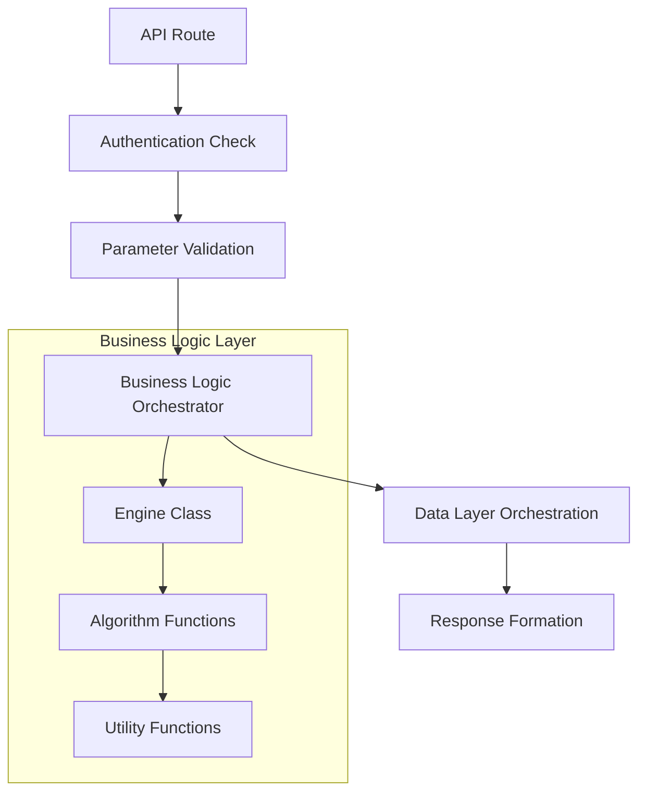
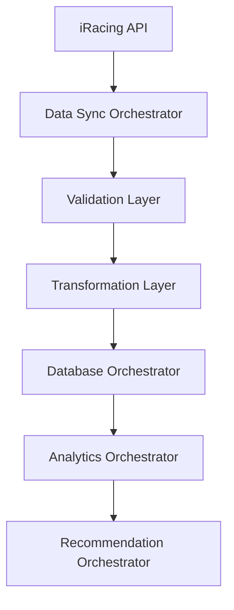
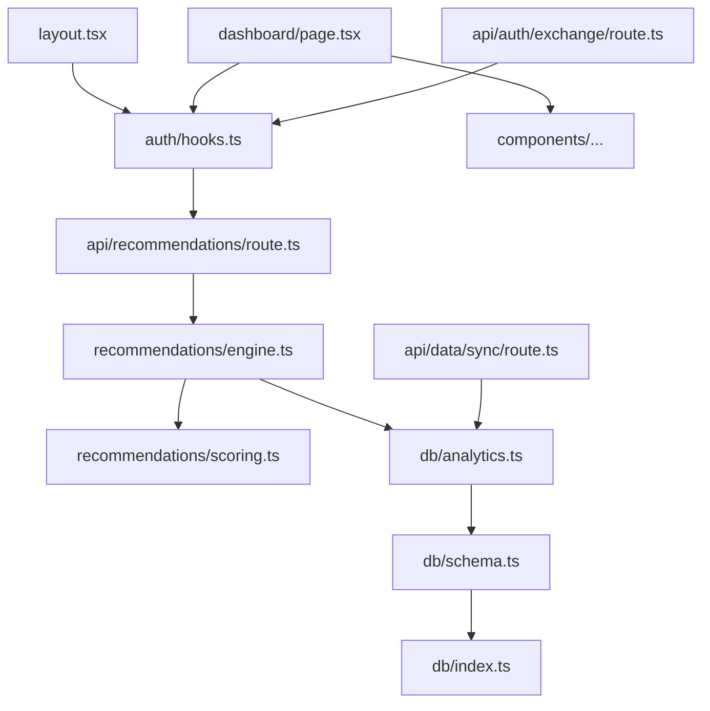

# Key Orchestrator Files

## Overview

This document identifies the main orchestrator files that control the core functionality of the "Should I Race This?" application. These files serve as the primary entry points and coordination layers for major system components.

## 🎯 Main Orchestrators by Layer

### **Frontend Orchestrators**

#### 1. Root Layout (`src/app/layout.tsx`)
**Role**: Application-wide provider orchestration
```typescript
// Coordinates all global providers and context
export default function RootLayout({ children }) {
  return (
    <html lang="en">
      <body>
        <AuthProvider>          // Authentication state
          <QueryProvider>       // Server state management
            <ThemeProvider>     // UI theming
              {children}
            </ThemeProvider>
          </QueryProvider>
        </AuthProvider>
      </body>
    </html>
  );
}
```

#### 2. Authentication Hook (`src/lib/auth/hooks.ts`)
**Role**: Client-side authentication orchestration
- Manages user session state
- Coordinates login/logout flows
- Provides authentication context to all components

#### 3. Dashboard Page (`src/app/dashboard/page.tsx`)
**Role**: Main dashboard orchestration
- Coordinates multiple analytics components
- Manages data fetching and state
- Orchestrates user interface layout

### **API Orchestrators**

#### 4. Recommendations API (`src/app/api/recommendations/route.ts`)
**Role**: Recommendation system entry point
```typescript
export async function GET(request: NextRequest) {
  // 1. Authentication validation
  const session = await getSession();
  
  // 2. Parameter parsing and validation
  const mode = searchParams.get('mode') as RecommendationMode;
  
  // 3. Orchestrate recommendation generation
  const result = await recommendationEngine.getFilteredRecommendations(
    session.userId, mode, filters
  );
  
  return NextResponse.json(result);
}
```

#### 5. Data Sync API (`src/app/api/data/sync/route.ts`)
**Role**: Data synchronization orchestration
- Coordinates iRacing API calls
- Manages batch processing
- Handles error recovery and retries

#### 6. OAuth Exchange (`src/app/api/auth/exchange/route.ts`)
**Role**: Authentication flow orchestration
- Manages PKCE validation
- Coordinates token exchange
- Orchestrates user creation/updates

### **Core Business Logic Orchestrators**

#### 7. Recommendation Engine (`src/lib/recommendations/engine.ts`)
**Role**: Main recommendation system orchestrator
```typescript
export class RecommendationEngine {
  async generateRecommendations(userId: string, mode: RecommendationMode) {
    // 1. Data preparation
    const userHistory = await prepareUserHistory(userId);
    const opportunities = await getCurrentRacingOpportunities();
    
    // 2. License filtering
    const eligibleOpportunities = licenseFilter(opportunities, userHistory.licenseClasses);
    
    // 3. Scoring algorithm
    const scoredOpportunities = await scoringAlgorithm(eligibleOpportunities, userHistory, mode);
    
    // 4. Visual indicators
    const recommendations = visualScoringRenderer(scoredOpportunities);
    
    return recommendations;
  }
}
```

#### 8. Scoring Algorithm (`src/lib/recommendations/scoring.ts`)
**Role**: Core scoring logic orchestration
- Coordinates 8-factor analysis
- Manages mode-specific weighting
- Orchestrates risk assessment

#### 9. Analytics Engine (`src/lib/db/analytics.ts`)
**Role**: Performance analytics orchestration
- Coordinates complex database queries
- Manages statistical calculations
- Orchestrates data aggregation

### **Data Layer Orchestrators**

#### 10. Database Schema (`src/lib/db/schema.ts`)
**Role**: Data model orchestration
- Defines all table relationships
- Manages computed columns
- Coordinates database constraints

#### 11. Database Index (`src/lib/db/index.ts`)
**Role**: Database connection orchestration
```typescript
import { drizzle } from 'drizzle-orm/neon-http';
import { neon } from '@neondatabase/serverless';

const sql = neon(process.env.DATABASE_URL!);
export const db = drizzle(sql);
```

#### 12. Data Preparation (`src/lib/recommendations/data-preparation.ts`)
**Role**: Data transformation orchestration
- Coordinates user history aggregation
- Manages schedule data fetching
- Orchestrates global statistics computation

## 🔄 Orchestration Flow Patterns

### **Request Flow Orchestration**


### **Data Flow Orchestration**


## 📁 File Hierarchy by Importance

### **Critical Path Files** (System won't work without these)
1. `src/app/layout.tsx` - Application bootstrap
2. `src/lib/db/index.ts` - Database connection
3. `src/lib/auth/hooks.ts` - Authentication state
4. `src/lib/recommendations/engine.ts` - Core business logic
5. `src/app/api/recommendations/route.ts` - Main API endpoint

### **Core Orchestrators** (Major feature coordination)
6. `src/lib/recommendations/scoring.ts` - Scoring algorithm
7. `src/lib/db/analytics.ts` - Analytics engine
8. `src/app/api/auth/exchange/route.ts` - OAuth flow
9. `src/app/api/data/sync/route.ts` - Data synchronization
10. `src/lib/recommendations/data-preparation.ts` - Data transformation

### **Feature Orchestrators** (Specific functionality)
11. `src/app/dashboard/page.tsx` - Dashboard coordination
12. `src/lib/recommendations/visual-scoring.ts` - UI scoring
13. `src/lib/recommendations/license-filter.ts` - Eligibility filtering
14. `src/lib/db/schema.ts` - Data model definitions

## 🎛️ Configuration Orchestrators

### **Environment Configuration**
- `.env.local` - Environment variables
- `next.config.js` - Next.js configuration
- `tailwind.config.js` - Styling configuration
- `drizzle.config.ts` - Database configuration

### **Type Orchestrators**
- `src/lib/recommendations/types.ts` - Core type definitions
- `src/types/index.ts` - Global type exports

## 🔧 Development Orchestrators

### **Build & Development**
- `package.json` - Dependency and script orchestration
- `tsconfig.json` - TypeScript compilation
- `jest.config.js` - Testing orchestration

### **Database Management**
- `scripts/reset-database.ts` - Database reset orchestration
- `drizzle/` - Migration orchestration

## 🚀 Quick Navigation for Developers

**Starting a new feature?** → Check `src/lib/recommendations/engine.ts`
**API issues?** → Check `src/app/api/recommendations/route.ts`
**Authentication problems?** → Check `src/lib/auth/hooks.ts`
**Database queries?** → Check `src/lib/db/analytics.ts`
**UI components?** → Check `src/app/dashboard/page.tsx`
**Data sync issues?** → Check `src/app/api/data/sync/route.ts`

## 📊 Orchestrator Dependencies



This orchestrator map provides the essential navigation points for understanding and modifying the system's core functionality.
