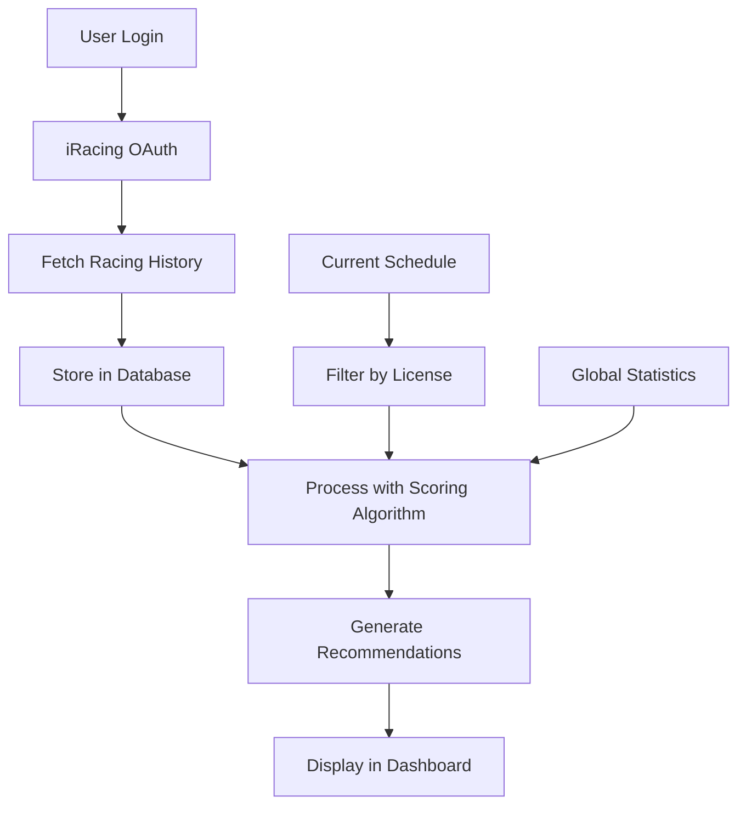

# Should I Race This? - Project Documentation

A data-driven iRacing recommendation system that helps drivers make smarter racing decisions by analyzing their performance history and providing personalized race recommendations.

## 📋 Documentation Index

### Core Architecture
- [**Project Overview**](./01-project-overview.md) - High-level system architecture and goals
- [**Key Orchestrator Files**](./10-key-orchestrator-files.md) - Main coordination files and entry points
- [**Database Schema**](./02-database-schema.md) - Data models and relationships
- [**API Endpoints**](./03-api-endpoints.md) - Complete API reference

### User Flow & Authentication
- [**User Journey**](./04-user-journey.md) - End-to-end user experience with flow diagrams
- [**OAuth Integration**](./05-oauth-integration.md) - iRacing authentication flow

### Recommendation Engine
- [**Recommendation System**](./06-recommendation-system.md) - Core algorithm and scoring factors
- [**Data Processing Pipeline**](./07-data-processing.md) - How iRacing data becomes recommendations

### Frontend & UI
- [**Pages & Components**](./08-pages-components.md) - Frontend structure and key components
- [**Dashboard Features**](./09-dashboard-features.md) - Analytics and visualization features

## 🚀 Quick Start

1. **Authentication**: Users authenticate via iRacing OAuth2
2. **Data Sync**: System fetches and processes racing history
3. **Analysis**: 8-factor scoring algorithm evaluates opportunities
4. **Recommendations**: Personalized race suggestions with confidence levels

## 🏁 Key Features

- **Smart Recommendations**: AI-powered race suggestions based on performance history
- **Multi-Mode Analysis**: Balanced, iRating push, or safety recovery modes
- **Real-time Data**: Live schedule integration with iRacing API
- **Performance Analytics**: Detailed insights into racing patterns and trends
- **Risk Assessment**: Safety and iRating risk evaluation for each opportunity

## 🛠 Technology Stack

- **Frontend**: Next.js 15, React 19, TypeScript, Tailwind CSS
- **Backend**: Next.js API routes, Drizzle ORM
- **Database**: PostgreSQL (Neon)
- **Authentication**: iRacing OAuth2 with PKCE
- **Data Visualization**: Recharts, custom racing-themed components

## 📊 Data Flow Overview

## 🎯 Recommendation Modes

- **Balanced**: Optimizes for both iRating and safety improvements
- **iRating Push**: Focuses on maximizing iRating gains
- **Safety Recovery**: Prioritizes safety rating improvement

## 📈 Scoring Factors

The system evaluates racing opportunities using 8 key factors:

1. **Performance**: Expected finishing position based on history
2. **Safety**: Predicted incident risk
3. **Consistency**: Finish position variability
4. **Predictability**: Field strength stability
5. **Familiarity**: Experience with series/track combination
6. **Fatigue Risk**: Race length and time commitment
7. **Attrition Risk**: DNF probability
8. **Time Volatility**: Participation level fluctuations

Each factor is scored 0-100 and weighted according to the selected recommendation mode.

---

*Navigate to any section above to dive deeper into specific aspects of the system.*
