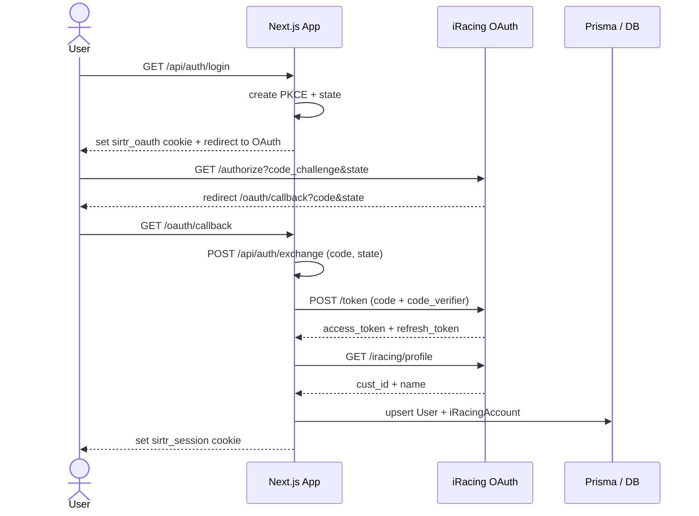

# OAuth and Data Ingestion Flow

This document explains the end-to-end OAuth flow, the iRacing data ingestion pipeline, the endpoints involved, and how raw iRacing data becomes the season-based performance summary shown to users.

## OAuth Flow (PKCE + session cookie)

### Key goals
- Authenticate the user with iRacing OAuth.
- Store access + refresh tokens in the database.
- Issue a signed, httpOnly session cookie used by app APIs.

### Internal endpoints
- `GET /api/auth/login`
  - Starts the OAuth flow.
  - Generates PKCE `state` + `code_verifier` and stores them in a signed transient cookie.
  - Redirects to the iRacing authorization URL.
- `POST /api/auth/exchange`
  - Accepts the OAuth `code` + `state` returned from iRacing.
  - Exchanges the code for tokens.
  - Fetches the iRacing profile to get `cust_id` and display name.
  - Upserts the user and iRacing account tokens.
  - Sets the signed `sirtr_session` cookie.
- `POST /api/logout`
  - Revokes the current access token and clears the session cookie.
- `GET /api/me`
  - Validates the session cookie and returns the current user.

### External iRacing OAuth endpoints
- `GET https://oauth.iracing.com/oauth2/authorize`
- `POST https://oauth.iracing.com/oauth2/token`
- `GET https://oauth.iracing.com/oauth2/iracing/profile`
- `POST https://oauth.iracing.com/oauth2/revoke`

### Cookie details
- Transient cookie: `sirtr_oauth`
  - Contains `state`, `code_verifier`, `createdAt`.
  - Short-lived (10 minutes).
- Session cookie: `sirtr_session`
  - Contains `iracing_cust_id`, `iracing_name`, `expiresAt`.
  - Signed with `SESSION_SECRET`.
  - Required for all authenticated app APIs.

### Mermaid diagram

## Token lifecycle

- Access tokens are short-lived and stored in `iRacingAccount.accessToken` with `accessTokenExpiresAt`.
- Refresh tokens are stored in `iRacingAccount.refreshToken`.
- API calls use `ensureValidAccessToken()` to refresh when needed.
- If refresh fails with `invalid_grant`, the user must re-authenticate.

## /data API guidance (forum notes)

From the iRacing forum post "General Availability of /data API":

- Legacy auth (`https://members-ng.iracing.com/auth`) is being removed as of the 2026 Season 1 release (Dec 9, 2025). OAuth2 is the supported path.
- For read-only access without acting on behalf of a user, the "password_limited" OAuth flow is recommended.
- For access to member-specific data (custid validation or member data requests), the authorization code flow + data API workflow is required.
- Data retrieval uses a Bearer access token in the `Authorization` header for all `/data` calls.
- Many endpoints return a JSON payload with a `link` to cached data. The link must be fetched to get the actual dataset.
- Rate limits are communicated via response headers:
  - `x-ratelimit-limit`
  - `x-ratelimit-remaining`
  - `x-ratelimit-reset`
- API documentation is discoverable at `/data/doc` and subpages like `/data/doc/car` or `/data/doc/car/assets`.

This app uses the authorization code flow because we need access to user-specific data (member results, stats, and pro

## Troubleshooting notes

- If `/api/performance` returns 401, the session cookie did not validate or no `iRacingAccount` exists.
- If `/api/sync/history` returns 0 races, double-check:
  - the `activeSeasonId` and `Season` rows
  - the discovered results endpoint
  - the `season_id` values returned by iRacing
- If refresh fails with `invalid_grant`, re-authenticate to refresh tokens.

